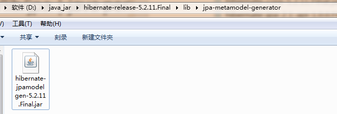

[TOC]

# SSH与SSM学习之SSH整合01——SSH整合原理和导包

## 一、SSH整合原理

其实整合原理就是，通过spring来管理和创建其他框架需要实例。如下


我们总过需要导入的包个数如下

> 12 个Hibernate包
>
> 11 个Struts2包
>
> 16 个Spring包
>
> 2 个标签库包

共 41 包

---


## 二、Hibernate导包

这里我们导入 12个包
> 10 个Hibernate的必须包
>
> 1 个java持久化包
>
> 1 个MySql数据库驱动包

### 2.1 必须的包(required)

我使用的版本是 **hibernate-release-5.2.11.Final**

包的位置是 **hibernate-release-5.2.11.Final\lib\required**

我的版本有 10 个包


### 2.2 java持久化包 jpa

java定义了 java persist api java的持久化规范(接口)

hibernate实现了这个规范。

包的位置是 **hibernate-release-5.2.11.Final\lib\jpa-metamodel-generator**

1 个包



### 2.3 MySql数据库驱动包

1 个包

```
mysql-connector-java-5.1.44-bin.jar
```


----

## 三、Struts2导包

这里我们导入 11 个包
> 7 个 Struts2 的必须包
>
> 1 个struts整合spring插件包
>
> 3 个其他的包

### 3.1 Struts2必须的包

下载 Struts2-min-lib 导入其中所有的包

8 个包（可以说是7个，因为和上面重复了一个）

这里导入的包中，如果 **javassist**包的版本和 Hibernate中导入的**javassist**包的版本不一样的话，

可能会导入了两个包，删除版本低的一个包。由于我们这里导入的都是 **javassist-3.20.0-GA.jar**，

所以没有重复。


### 3.2 struts整合spring插件包

如果我们只是单独来弄 Struts2 不包含 Spring,那么千万不要导入下面这个包。但是我们现在是 SSH 整合，所以

需要导入下面这个包。

注意:这个包一旦导入,那么Struts2在启动时就会寻找Spring容器.找不到将会抛出异常

1 个包

```
struts2-spring-plugin-2.5.13.jar
```

### 3.3 其他的包

除了上面的包以外，还需要导入下面的包

3 个包

```
asm-5.2.jar

asm-commons-5.2.jar

asm-tree-5.2.jar
```

---

## 四、Spring导包

这里我们导入 16 个包
> 4 个 Spring核心包
>
> 2 个日志包
>
> 1 个web包
>
> 4 个Spring AOP包
>
> 4 个整合Hibernate和事务
>
> 1 个junit4测试

### 4.1 Spring核心包

4 个

```
spring-beans

spring-context

spring-core

spring-expression
```

### 4.2 日志包

2 个

```
commons-logging

log4j
```

### 4.3 整合web:web包

1 个

```
spring-web
```

### 4.4 Spring AOP包

4 个

```
spring-aop

spring-aspects

org.aspectj.weaver

org.aopalliance
```


### 4.5 整合Hibernate和事务

 4 个

 ```
spring-jdbc

spring-tx

c3p0

spring-orm

 ```


### 4.6 Spring中junit4测试

1 个

```
spring-test
```

## 五、标签库

2 个包

```
standard.jar

jstl-1.2.jar
```