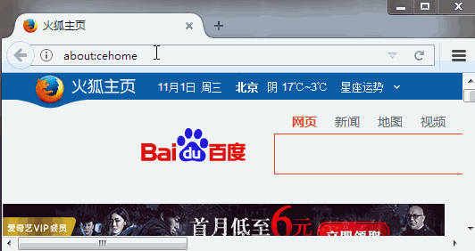

[TOC]

# SSH与SSM学习之SSH整合03——单独配置Struts2

## 一、配置Struts2主配置文件
在 src 目录下，文件名称是：struts.xml

```xml
<?xml version="1.0" encoding="UTF-8" ?>
<!DOCTYPE struts PUBLIC
        "-//Apache Software Foundation//DTD Struts Configuration 2.5//EN"
        "http://struts.apache.org/dtds/struts-2.5.dtd">
<struts>
    <!-- 配置动态方法调用是否开启常量  默认是关闭的,需要开启-->
    <constant name="struts.enable.DynamicMethodInvocation" value="true"/>

    <package name="crm1" namespace="/" extends="struts-default">
        <!--全局允许方法调用-->
        <global-allowed-methods>regex:.*</global-allowed-methods>
        <action name="userAction_*" class="com.qwm.ssh_crm.web.action.UserAction" method="{1}">
            <result name="success">/success.jsp</result>
        </action>
    </package>
</struts>
```

---

## 二、将Struts2核心过滤器配置到web.xml

打开我们 web/WEB-INF/web.xml 文件，添加我们 struts2核心过滤器配置。
如下

```xml
<!--struts2核心过滤器配置-->
<filter>
    <filter-name>struts2</filter-name>
    <filter-class>org.apache.struts2.dispatcher.filter.StrutsPrepareAndExecuteFilter</filter-class>
</filter>
<filter-mapping>
    <filter-name>struts2</filter-name>
    <url-pattern>/*</url-pattern>
</filter-mapping>
```

---

## 三、测试

在浏览器中输入 [http://127.0.0.1:8080/crm/userAction_execute]()



---

## 四、源码下载

[https://github.com/wimingxxx/ssh_crm](https://github.com/wimingxxx/ssh_crm)