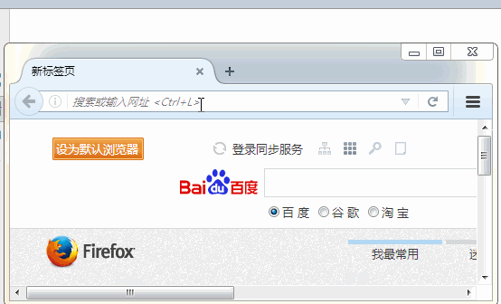
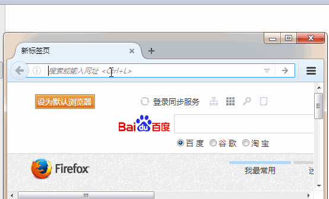

[TOC]

# SSH与SSM学习之SSH整合04——Struts2与Spring整合

## 一、整合原理

Struts2与Spring整合就是将 Action对象 交个Spring容器创建。注意的是，Action对象 一定要配置成多例的形式。


---

## 二、创建需要使用的类

### 2.1 User类

```java
package com.qwm.ssh_crm.domain;

/**
 * @author：qiwenming
 * @date：2017/11/2 0002   21:49
 * @description：
 */
public class User {
}

```

### 2.2 UserService
```
package com.qwm.ssh_crm.service;

import com.qwm.ssh_crm.domain.User;

/**
 * @author：qiwenming
 * @date：2017/11/2 0002   21:48
 * @description：
 */
public interface UserService {
    User getUserByCodePassword();
}

```


### 2.3 UserServiceImpl
```java
package com.qwm.ssh_crm.service;

import com.qwm.ssh_crm.domain.User;

/**
 * @author：qiwenming
 * @date：2017/11/2 0002   21:48
 * @description：
 */
public class UserServiceImpl implements UserService{
    @Override
    public User getUserByCodePassword() {
        return null;
    }
}
```


### 2.4 UserAction
```java
package com.qwm.ssh_crm.web.action;

import com.opensymphony.xwork2.ActionSupport;
import com.qwm.ssh_crm.service.UserService;

/**
 * @author：qiwenming
 * @date：2017/11/1 0001   23:37
 * @description：
 */
public class UserAction extends ActionSupport{
    private UserService userService;

    public String login() throws Exception{
        System.out.println(userService);
        return super.execute();
    }

    public void setUserService(UserService userService) {
        this.userService = userService;
    }
}
```

## 三、常量配置

这里有两个常量需要注意。我们需要使用Spring与Struts2整合，需要在 struts.xml中配置下面的两个常量。

其中 **struts.objectFactory.spring.autoWire = name**默认已经配置，所以不用配置啦。

```
struts.objectFactory = spring	将action的创建交给spring容器

struts.objectFactory.spring.autoWire = name spring负责装配Action依赖属性 默认已经打开了
 ```

接下来的整合有两种配置。

---

## 四、整合方案1:struts2自己创建action,spring负责组装依赖属性

### 4.1 struts.xml

这种配置，struts2自己创建action,spring负责组装依赖属性。也就是Struts和之前的配置差不多，就是多了 常量配置

struts.xml

```xml
<?xml version="1.0" encoding="UTF-8" ?>
<!DOCTYPE struts PUBLIC
        "-//Apache Software Foundation//DTD Struts Configuration 2.5//EN"
        "http://struts.apache.org/dtds/struts-2.5.dtd">
<struts>
    <!-- 配置动态方法调用是否开启常量  默认是关闭的,需要开启-->
    <constant name="struts.enable.DynamicMethodInvocation" value="true"/>

    <!--
       struts.objectFactory = spring	将action的创建交给spring容器
        struts.objectFactory.spring.autoWire = name spring负责装配Action依赖属性 默认已经打开了-->
    <constant name="struts.objectFactory" value="spring"/>

    <package name="crm1" namespace="/" extends="struts-default">
        <!--全局允许方法调用-->
        <global-allowed-methods>regex:.*</global-allowed-methods>
        <action name="UserAction_*" class="com.qwm.ssh_crm.web.action.UserAction" method="{1}">
            <result name="success">/success.jsp</result>
        </action>
    </package>
</struts>
```

### 4.2 applicationContext.xml

 Spring负责组装依赖属性。也就是 Spring需要给 Action 组装 **UserService**。这里需要注意的是

 Spring配置文件中 定义的 UserService 的名字，必须和 UserAction中 UserService 的名字是一样的，

 否则无法自动注入。

applicationContext.xml

```
<?xml version="1.0" encoding="UTF-8" ?>
<beans xmlns:xsi="http://www.w3.org/2001/XMLSchema-instance"
       xmlns="http://www.springframework.org/schema/beans"
       xmlns:context="http://www.springframework.org/schema/context"
       xsi:schemaLocation="http://www.springframework.org/schema/beans
            http://www.springframework.org/schema/beans/spring-beans-4.3.xsd
            http://www.springframework.org/schema/context
            http://www.springframework.org/schema/context/spring-context-4.3.xsd ">

    <!--Action配置-->
    <bean name="userAction" class="com.qwm.ssh_crm.web.action.UserAction"/>

    <!--Service配置-->
    <bean name="userService" class="com.qwm.ssh_crm.service.UserServiceImpl"/>
</beans>
```


不推荐理由:最好由spring完整管理action的生命周期.spring中功能才应用到Action上.

---

### 4.3 运行结果




---

## 五、整合方案2:spring负责创建action以及组装.
这种配置，spring负责创建action以及组装。

### 5.1 applicationContext.xml

注意的是，Action参数的组装需要手动来组装。 Action 必须配置为多例模式。

applicationContext.xml

```xml
<?xml version="1.0" encoding="UTF-8" ?>
<beans xmlns:xsi="http://www.w3.org/2001/XMLSchema-instance"
       xmlns="http://www.springframework.org/schema/beans"
       xmlns:context="http://www.springframework.org/schema/context"
       xsi:schemaLocation="http://www.springframework.org/schema/beans
            http://www.springframework.org/schema/beans/spring-beans-4.3.xsd
            http://www.springframework.org/schema/context
            http://www.springframework.org/schema/context/spring-context-4.3.xsd ">

    <!--Action配置 手动组装依赖  必须配置为多例模式-->
    <bean name="userAction" class="com.qwm.ssh_crm.web.action.UserAction" scope="prototype">
        <property name="userService" ref="userService"/>
    </bean>

    <!--Service配置-->
    <bean name="userService" class="com.qwm.ssh_crm.service.UserServiceImpl"/>
</beans>
```

### 5.2 struts.xml

这里主要的改变就是，Action 的class属性不再是全类名，而是上面 Spring中配置的Action名称。

5.2 struts.xml

```xml
<?xml version="1.0" encoding="UTF-8" ?>
<!DOCTYPE struts PUBLIC
        "-//Apache Software Foundation//DTD Struts Configuration 2.5//EN"
        "http://struts.apache.org/dtds/struts-2.5.dtd">
<struts>
    <!-- 配置动态方法调用是否开启常量  默认是关闭的,需要开启-->
    <constant name="struts.enable.DynamicMethodInvocation" value="true"/>

    <!--
       struts.objectFactory = spring	将action的创建交给spring容器
        struts.objectFactory.spring.autoWire = name spring负责装配Action依赖属性 默认已经打开了-->
    <constant name="struts.objectFactory" value="spring"/>

    <package name="crm1" namespace="/" extends="struts-default">
        <!--全局允许方法调用-->
        <global-allowed-methods>regex:.*</global-allowed-methods>

        <!--class属性值，来自applicationContext.xml 中 Action的配置-->
        <action name="UserAction_*" class="userAction" method="{1}">
            <result name="success">/success.jsp</result>
        </action>
    </package>
</struts>
```

### 5.3 运行结果

