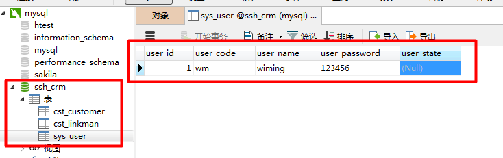

[TOC]

# SSH与SSM学习之SSH整合05——单独配置Hibernate

## 一、导入实体类的配置

这一部分的配置可以使用之前代码的。获取查看如下地址的

[https://github.com/wimingxxx/ssh_crm/tree/master/src/com/qwm/ssh_crm/domain](https://github.com/wimingxxx/ssh_crm/tree/master/src/com/qwm/ssh_crm/domain)

```xml
Customer
Customer.hbm.xml

LinkMan
LinkMan.hbm.xml

User
User.hbm.xml
```

---

## 二、配置hibernate.cfg.xml

```xml
<?xml version="1.0" encoding="UTF-8"?>
<!DOCTYPE hibernate-configuration PUBLIC
        "-//Hibernate/Hibernate Configuration DTD 3.0//EN"
        "http://www.hibernate.org/dtd/hibernate-configuration-3.0.dtd">
<hibernate-configuration>
    <session-factory>
        <!-- 数据库驱动 -->
        <property name="hibernate.connection.driver_class">com.mysql.jdbc.Driver</property>
        <!-- 数据库url -->
        <property name="hibernate.connection.url">jdbc:mysql:///ssh_crm</property>
        <!-- 数据库连接用户名 -->
        <property name="hibernate.connection.username">root</property>
        <!-- 数据库连接密码 -->
        <property name="hibernate.connection.password">xm123456</property>

        <!-- 数据库方言-->
        <property name="hibernate.dialect">org.hibernate.dialect.MySQL5Dialect</property>

        <!-- 将hibernate生成的sql语句打印到控制台 -->
        <property name="hibernate.show_sql">true</property>
        <!-- 将hibernate生成的sql语句格式化(语法缩进) -->
        <property name="hibernate.format_sql">true</property>
        <!--
        自动导出表结构. 自动建表
         -->
        <property name="hibernate.hbm2ddl.auto">update</property>

        <!-- 引入实体配置文件 -->
        <mapping resource="com/qwm/ssh_crm/domain/Customer.hbm.xml" />
        <mapping resource="com/qwm/ssh_crm/domain/LinkMan.hbm.xml" />
        <mapping resource="com/qwm/ssh_crm/domain/User.hbm.xml" />

    </session-factory>
</hibernate-configuration>
```

---

## 三、测试
### 3.1 测试代码
```java
 @Test
    public void test1() {
        // 1. 配置类型安全的准服务注册类，这是当前应用的单例对象，不作修改，所以声明为final
        final StandardServiceRegistry registry = new StandardServiceRegistryBuilder().configure("hibernate.cfg.xml").build();
        // 2. 根据服务注册类创建一个元数据资源集，同时构建元数据并生成应用一般唯一的的session工厂
        SessionFactory sessionFactory = new MetadataSources(registry).buildMetadata().buildSessionFactory();
        //3. 获取session
        Session session = sessionFactory.openSession();
        //4 开启事务
        Transaction transaction = session.beginTransaction();

        User user = new User();
        user.setUser_code("wm");
        user.setUser_name("wiming");
        user.setUser_password("123456");

        //5 数据持久化
        session.save(user);

        //6 提交事务
        transaction.commit();

        //7 关闭session
        session.close();

    }
```

### 3.2 运行结果与图示

```sql
Hibernate:

    create table cst_customer (
       cust_id bigint not null auto_increment,
        cust_name varchar(255),
        cust_source varchar(255),
        cust_industry varchar(255),
        cust_level varchar(255),
        cust_linkman varchar(255),
        cust_phone varchar(255),
        cust_mobile varchar(255),
        primary key (cust_id)
    ) engine=MyISAM
Hibernate:

    create table cst_linkman (
       lkm_id bigint not null auto_increment,
        lkm_gender char(1),
        lkm_name varchar(255),
        lkm_phone varchar(255),
        lkm_email varchar(255),
        lkm_qq varchar(255),
        lkm_mobile varchar(255),
        lkm_memo varchar(255),
        lkm_position varchar(255),
        lkm_cust_id bigint,
        primary key (lkm_id)
    ) engine=MyISAM
Hibernate:

    create table sys_user (
       user_id bigint not null auto_increment,
        user_code varchar(255),
        user_name varchar(255),
        user_password varchar(255),
        user_state char(1),
        primary key (user_id)
    ) engine=MyISAM
Hibernate:

    alter table cst_linkman
       add constraint FKh9yp1nql5227xxcopuxqx2e7q
       foreign key (lkm_cust_id)
       references cst_customer (cust_id)
Hibernate:
    insert
    into
        sys_user
        (user_code, user_name, user_password, user_state)
    values
        (?, ?, ?, ?)
```

图示

