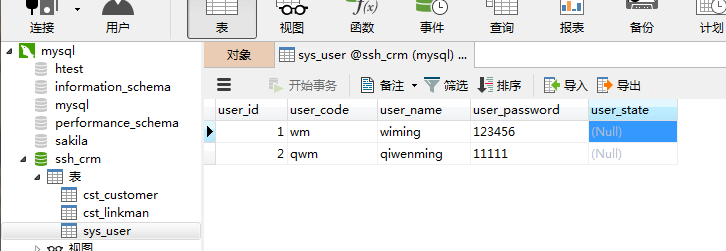
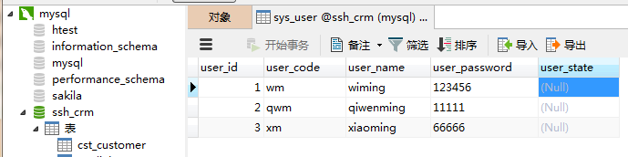

[TOC]

# SSH与SSM学习之SSH整合06——Hibernate与Spring整合

## 一、整合原理

将sessionFactory对象交给spring容器管理

---

## 二、在Spring中配置sessionFactory方案一（不推荐）

这种配置方式，在 Spring的配置中配置 SessionFactory ,指定 Hibernate配置文件的位置

### 2.1 applicationContext.xml

applicationContext.xml

```xml
<?xml version="1.0" encoding="UTF-8" ?>
<beans xmlns:xsi="http://www.w3.org/2001/XMLSchema-instance"
       xmlns="http://www.springframework.org/schema/beans"
       xmlns:context="http://www.springframework.org/schema/context"
       xsi:schemaLocation="http://www.springframework.org/schema/beans
            http://www.springframework.org/schema/beans/spring-beans-4.3.xsd
            http://www.springframework.org/schema/context
            http://www.springframework.org/schema/context/spring-context-4.3.xsd ">

    <!--Action配置 手动组装依赖  必须配置为多例模式-->
    <bean name="userAction" class="com.qwm.ssh_crm.web.action.UserAction" scope="prototype">
        <property name="userService" ref="userService"/>
    </bean>

    <!--Service配置-->
    <bean name="userService" class="com.qwm.ssh_crm.service.UserServiceImpl"/>

    <!--将SessionFactory配置到Spring容器中-->
    <!--加载配置方案一：仍然使用外部的hibernate.cfg.xml配置信息-->
    <bean name="sessionFactory" class="org.springframework.orm.hibernate5.LocalSessionFactoryBean">
        <property name="configLocation" value="classpath:hibernate.cfg.xml"/>
    </bean>
</beans>
```

### 2.2 测试代码

```java
/**
 * @author：qiwenming
 * @date：2017/11/2 0002   23:06
 * @description： Hiberante单元测试
 */
@RunWith(SpringJUnit4ClassRunner.class)
@ContextConfiguration("classpath:applicationContext.xml")
public class HibernateTest {

    @Resource(name = "sessionFactory")
    private SessionFactory sessionFactory;

    @Test
    public void test2(){
        Session session = sessionFactory.openSession();
        Transaction transaction = session.beginTransaction();

        User user = new User();
        user.setUser_code("qwm");
        user.setUser_name("qiwenming");
        user.setUser_password("11111");

        session.save(user);

        transaction.commit();
        session.close();
    }
}
```

### 2.3 测试结果以及图示

```sql
Hibernate:

    alter table cst_linkman
       add constraint FKh9yp1nql5227xxcopuxqx2e7q
       foreign key (lkm_cust_id)
       references cst_customer (cust_id)
Hibernate:
    insert
    into
        sys_user
        (user_code, user_name, user_password, user_state)
    values
        (?, ?, ?, ?)
```

图示



---

## 三、在Spring中配置sessionFactory方案二（推荐）

这种配置就是把 hibernate的相关配置，放到 Spring的配置文件中来配置

### 3.1 applicationContext.xml

上面的配置可以改为如下的配置

```xml
<?xml version="1.0" encoding="UTF-8" ?>
<beans xmlns:xsi="http://www.w3.org/2001/XMLSchema-instance"
       xmlns="http://www.springframework.org/schema/beans"
       xmlns:context="http://www.springframework.org/schema/context"
       xsi:schemaLocation="http://www.springframework.org/schema/beans
            http://www.springframework.org/schema/beans/spring-beans-4.3.xsd
            http://www.springframework.org/schema/context
            http://www.springframework.org/schema/context/spring-context-4.3.xsd ">

    <!--Action配置 手动组装依赖  必须配置为多例模式-->
    <bean name="userAction" class="com.qwm.ssh_crm.web.action.UserAction" scope="prototype">
        <property name="userService" ref="userService"/>
    </bean>

    <!--Service配置-->
    <bean name="userService" class="com.qwm.ssh_crm.service.UserServiceImpl"/>

 <!--   &lt;!&ndash;将SessionFactory配置到Spring容器中&ndash;&gt;
    &lt;!&ndash;加载配置方案一：仍然使用外部的hibernate.cfg.xml配置信息&ndash;&gt;
    <bean name="sessionFactory" class="org.springframework.orm.hibernate5.LocalSessionFactoryBean">
        <property name="configLocation" value="classpath:hibernate.cfg.xml"/>
    </bean>-->

    <bean name="sessionFactory" class="org.springframework.orm.hibernate5.LocalSessionFactoryBean">
        <property name="hibernateProperties">
            <props>
                <!--  必选配置 -->
                <prop key="hibernate.connection.driver_class">com.mysql.jdbc.Driver</prop>
                <prop key="hibernate.connection.url">jdbc:mysql:///ssh_crm</prop>
                <prop key="hibernate.connection.username">root</prop>
                <prop key="hibernate.connection.password">xm123456</prop>

                <prop key="hibernate.dialect">org.hibernate.dialect.MySQL5Dialect</prop>

                <!--  可选配置 -->
                <prop key="hibernate.show_sql">true</prop>
                <prop key="hibernate.format_sql">true</prop>
                <prop key="hibernate.hbm2ddl.auto">update</prop>
            </props>
        </property>
        <!-- 引入orm元数据,指定orm元数据所在的包路径,spring会自动读取包中的所有配置 -->
        <property name="mappingDirectoryLocations" value="classpath:com/qwm/ssh_crm/domain"></property>
    </bean>
</beans>
```

### 3.2 测试结果以及图示

```sql
Hibernate:

    alter table cst_linkman
       add constraint FKh9yp1nql5227xxcopuxqx2e7q
       foreign key (lkm_cust_id)
       references cst_customer (cust_id)
Hibernate:
    insert
    into
        sys_user
        (user_code, user_name, user_password, user_state)
    values
        (?, ?, ?, ?)
```

图示




---

## 四、源码下载

[https://github.com/wimingxxx/ssh_crm](https://github.com/wimingxxx/ssh_crm)