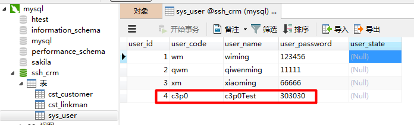

[TOC]

# SSH与SSM学习之SSH整合07——Spring整合c3p0连接池

## 一、整合说明
主要实现的功能如下：

1. 数据库信息的配置，单独放到一个properties文件中（db.properties）

2. 在Spring的配置文件 applicationContext.xml 中读取 1 中的文件

3. 在Spring中放入 c3p0 连接池对象，信息来自 2 中读取的信息

4. 把 3 中配置的连接池 组装到 Spring中hibernate的配置中。


---

## 二、db.properties

```xml
jdbc.jdbcUrl=jdbc:mysql:///ssh_crm
jdbc.driverClass=com.mysql.jdbc.Driver
jdbc.user=root
jdbc.password=xm123456
```


---

## 三、Spring配置中读取 db.properties

```xml
    <!-- 指定spring读取db.properties配置 -->
    <context:property-placeholder location="classpath:db.properties"/>
```

---

## 四、配置C3P0连接池

```xml
    <!-- 将连接池放入spring容器 -->
    <bean name="dataSource" class="com.mchange.v2.c3p0.ComboPooledDataSource">
        <property name="jdbcUrl" value="${jdbc.jdbcUrl}"/>
        <property name="driverClass" value="${jdbc.driverClass}"/>
        <property name="user" value="${jdbc.user}"/>
        <property name="password" value="${jdbc.password}"/>
    </bean>
```

---

## 五、把连接池组装到hibernate的连接池中

```xml
<bean name="sessionFactory" class="org.springframework.orm.hibernate5.LocalSessionFactoryBean">
        <!--装配连接池-->
        <property name="dataSource" ref="dataSource"/>
        <property name="hibernateProperties">
            <props>
                <prop key="hibernate.dialect">org.hibernate.dialect.MySQL5Dialect</prop>

                <!--  可选配置 -->
                <prop key="hibernate.show_sql">true</prop>
                <prop key="hibernate.format_sql">true</prop>
                <prop key="hibernate.hbm2ddl.auto">update</prop>
            </props>
        </property>
        <!-- 引入orm元数据,指定orm元数据所在的包路径,spring会自动读取包中的所有配置 -->
        <property name="mappingDirectoryLocations" value="classpath:com/qwm/ssh_crm/domain"></property>
    </bean>
```

---

## 六、完整的Spring配置文件

applicationContext.xml

```xml
<?xml version="1.0" encoding="UTF-8" ?>
<beans xmlns:xsi="http://www.w3.org/2001/XMLSchema-instance"
       xmlns="http://www.springframework.org/schema/beans"
       xmlns:context="http://www.springframework.org/schema/context"
       xsi:schemaLocation="http://www.springframework.org/schema/beans
            http://www.springframework.org/schema/beans/spring-beans-4.3.xsd
            http://www.springframework.org/schema/context
            http://www.springframework.org/schema/context/spring-context-4.3.xsd ">

    <!--Action配置 手动组装依赖  必须配置为多例模式-->
    <bean name="userAction" class="com.qwm.ssh_crm.web.action.UserAction" scope="prototype">
        <property name="userService" ref="userService"/>
    </bean>

    <!--Service配置-->
    <bean name="userService" class="com.qwm.ssh_crm.service.UserServiceImpl"/>

    <!-- 指定spring读取db.properties配置 -->
    <context:property-placeholder location="classpath:db.properties"/>

    <!-- 将连接池放入spring容器 -->
    <bean name="dataSource" class="com.mchange.v2.c3p0.ComboPooledDataSource">
        <property name="jdbcUrl" value="${jdbc.jdbcUrl}"/>
        <property name="driverClass" value="${jdbc.driverClass}"/>
        <property name="user" value="${jdbc.user}"/>
        <property name="password" value="${jdbc.password}"/>
    </bean>

    <bean name="sessionFactory" class="org.springframework.orm.hibernate5.LocalSessionFactoryBean">
        <!--装配连接池-->
        <property name="dataSource" ref="dataSource"/>
        <property name="hibernateProperties">
            <props>
                <prop key="hibernate.dialect">org.hibernate.dialect.MySQL5Dialect</prop>

                <!--  可选配置 -->
                <prop key="hibernate.show_sql">true</prop>
                <prop key="hibernate.format_sql">true</prop>
                <prop key="hibernate.hbm2ddl.auto">update</prop>
            </props>
        </property>
        <!-- 引入orm元数据,指定orm元数据所在的包路径,spring会自动读取包中的所有配置 -->
        <property name="mappingDirectoryLocations" value="classpath:com/qwm/ssh_crm/domain"></property>
    </bean>
</beans>
```

---

## 七、测试代码
```java
/**
 * @author：qiwenming
 * @date：2017/11/2 0002   23:06
 * @description： Hiberante单元测试
 */
@RunWith(SpringJUnit4ClassRunner.class)
@ContextConfiguration("classpath:applicationContext.xml")
public class HibernateTest {
    @Test
    public void test4(){
        Session session = sessionFactory.openSession();
        Transaction transaction = session.beginTransaction();

        User user = new User();
        user.setUser_code("c3p0");
        user.setUser_name("c3p0Test");
        user.setUser_password("303030");

        session.save(user);

        transaction.commit();
        session.close();
    }
}
```

---

## 八、运行结果与图示

```sql
Hibernate:

    alter table cst_linkman
       add constraint FKh9yp1nql5227xxcopuxqx2e7q
       foreign key (lkm_cust_id)
       references cst_customer (cust_id)
Hibernate:
    insert
    into
        sys_user
        (user_code, user_name, user_password, user_state)
    values
        (?, ?, ?, ?)
```

图示




---

## 九、源码下载

[https://github.com/wimingxxx/ssh_crm](https://github.com/wimingxxx/ssh_crm)