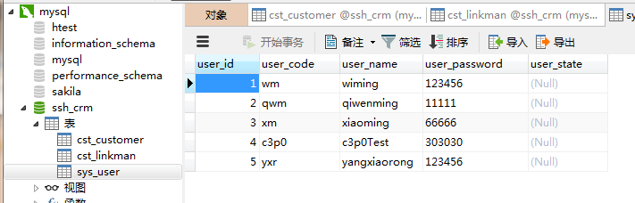
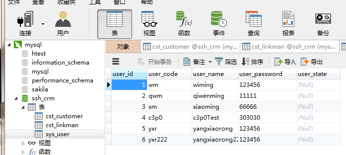

[TOC]

# SSH与SSM学习之SSH整合09——Spring的aop事务

## 一、AOP事务

这里的事务，其实和之前的JDBC的事务是一样的，唯一的不同就是我们这里的事务使用的核心事务管理器是
**HibernateTransactionManager**。

---

## 二、Spring配置文件中配置HibernateTransactionManager

配置 HibernateTransactionManager 核心事务管理器，主要的配置如下

```xml
    <!-- Hibernate 核心事务管理器-->
    <bean name="transactionManager" class="org.springframework.orm.hibernate5.HibernateTransactionManager">
        <property name="sessionFactory" ref="sessionFactory"/>
    </bean>
```

---

## 三、xml配置aop事务

### 3.1 UserServiceImpl
```java
/**
 * @author：qiwenming
 * @date：2017/11/2 0002   21:48
 * @description：
 */
public class UserServiceImpl implements UserService{

    private UserDao ud;

    @Override
    public User getUserByCodePassword(User u) {
        return null;
    }

    @Override
    public void saveUser(User u) {
        ud.save(u);
    }

    public void setUd(UserDao ud) {
        this.ud = ud;
    }
}

```

### 3.2 配置通知

在Spring配置中配置事务的通知，主要如下

```xml
    <!--配置事务通知-->
    <tx:advice id="txAdvice" transaction-manager="transactionManager">
        <tx:attributes>
            <!-- 以方法为单位,指定方法应用什么事务属性
                isolation:隔离级别
                propagation:传播行为
                read-only:是否只读
             -->
            <tx:method name="save*" isolation="REPEATABLE_READ" propagation="REQUIRED" read-only="false"/>
            <tx:method name="persist*" isolation="REPEATABLE_READ" propagation="REQUIRED" read-only="false"/>
            <tx:method name="update*" isolation="REPEATABLE_READ" propagation="REQUIRED" read-only="false"/>
            <tx:method name="modify*" isolation="REPEATABLE_READ" propagation="REQUIRED" read-only="false"/>
            <tx:method name="delete*" isolation="REPEATABLE_READ" propagation="REQUIRED" read-only="false"/>
            <tx:method name="remove*" isolation="REPEATABLE_READ" propagation="REQUIRED" read-only="false"/>
            <tx:method name="get*" isolation="REPEATABLE_READ" propagation="REQUIRED" read-only="true"/>
            <tx:method name="find*" isolation="REPEATABLE_READ" propagation="REQUIRED" read-only="true"/>
        </tx:attributes>
    </tx:advice>
```


### 3.3 配置织入

```xml
    <!--配置织入-->
    <aop:config>
        <!--配置切入点表达式-->
        <aop:pointcut id="txPc" expression="execution(* com.qwm.ssh_crm.service.*ServiceImpl.*(..))"/>
        <!--配置切面：通知+切点-->
        <aop:advisor advice-ref="txAdvice" pointcut-ref="txPc"/>
    </aop:config>
```

### 3.4 完整的 Spring配置文件
```xml
<?xml version="1.0" encoding="UTF-8" ?>
<beans xmlns:xsi="http://www.w3.org/2001/XMLSchema-instance"
       xmlns="http://www.springframework.org/schema/beans"
       xmlns:context="http://www.springframework.org/schema/context"
       xmlns:tx="http://www.springframework.org/schema/tx"
       xmlns:aop="http://www.springframework.org/schema/aop"
       xsi:schemaLocation="http://www.springframework.org/schema/beans
            http://www.springframework.org/schema/beans/spring-beans-4.3.xsd
            http://www.springframework.org/schema/context
            http://www.springframework.org/schema/context/spring-context-4.3.xsd
            http://www.springframework.org/schema/aop
            http://www.springframework.org/schema/aop/spring-aop-4.3.xsd
            http://www.springframework.org/schema/tx
            http://www.springframework.org/schema/tx/spring-tx-4.3.xsd " >

    <!--Action配置 手动组装依赖  必须配置为多例模式-->
    <bean name="userAction" class="com.qwm.ssh_crm.web.action.UserAction" scope="prototype">
        <property name="userService" ref="userService"/>
    </bean>

    <!--Service配置-->
    <bean name="userService" class="com.qwm.ssh_crm.service.UserServiceImpl">
        <property name="ud" ref="userDao"/>
    </bean>

    <!-- 指定spring读取db.properties配置 -->
    <context:property-placeholder location="classpath:db.properties"/>

    <!-- 将连接池放入spring容器 -->
    <bean name="dataSource" class="com.mchange.v2.c3p0.ComboPooledDataSource">
        <property name="jdbcUrl" value="${jdbc.jdbcUrl}"/>
        <property name="driverClass" value="${jdbc.driverClass}"/>
        <property name="user" value="${jdbc.user}"/>
        <property name="password" value="${jdbc.password}"/>
    </bean>

    <bean name="sessionFactory" class="org.springframework.orm.hibernate5.LocalSessionFactoryBean">
        <!--装配连接池-->
        <property name="dataSource" ref="dataSource"/>
        <property name="hibernateProperties">
            <props>
                <prop key="hibernate.dialect">org.hibernate.dialect.MySQL5Dialect</prop>

                <!--  可选配置 -->
                <prop key="hibernate.show_sql">true</prop>
                <prop key="hibernate.format_sql">true</prop>
                <prop key="hibernate.hbm2ddl.auto">update</prop>
            </props>
        </property>
        <!-- 引入orm元数据,指定orm元数据所在的包路径,spring会自动读取包中的所有配置 -->
        <property name="mappingDirectoryLocations" value="classpath:com/qwm/ssh_crm/domain"></property>
    </bean>

    <!--dao配置-->
    <bean name="userDao" class="com.qwm.ssh_crm.dao.impl.UserDaoImpl">
        <property name="sessionFactory" ref="sessionFactory"/>
    </bean>

    <!-- Hibernate 核心事务管理器-->
    <bean name="transactionManager" class="org.springframework.orm.hibernate5.HibernateTransactionManager">
        <property name="sessionFactory" ref="sessionFactory"/>
    </bean>

    <!--配置事务通知-->
    <tx:advice id="txAdvice" transaction-manager="transactionManager">
        <tx:attributes>
            <!-- 以方法为单位,指定方法应用什么事务属性
                isolation:隔离级别
                propagation:传播行为
                read-only:是否只读
             -->
            <tx:method name="save*" isolation="REPEATABLE_READ" propagation="REQUIRED" read-only="false"/>
            <tx:method name="persist*" isolation="REPEATABLE_READ" propagation="REQUIRED" read-only="false"/>
            <tx:method name="update*" isolation="REPEATABLE_READ" propagation="REQUIRED" read-only="false"/>
            <tx:method name="modify*" isolation="REPEATABLE_READ" propagation="REQUIRED" read-only="false"/>
            <tx:method name="delete*" isolation="REPEATABLE_READ" propagation="REQUIRED" read-only="false"/>
            <tx:method name="remove*" isolation="REPEATABLE_READ" propagation="REQUIRED" read-only="false"/>
            <tx:method name="get*" isolation="REPEATABLE_READ" propagation="REQUIRED" read-only="true"/>
            <tx:method name="find*" isolation="REPEATABLE_READ" propagation="REQUIRED" read-only="true"/>
        </tx:attributes>
    </tx:advice>

    <!--配置织入-->
    <aop:config>
        <!--配置切入点表达式-->
        <aop:pointcut id="txPc" expression="execution(* com.qwm.ssh_crm.service.*ServiceImpl.*(..))"/>
        <!--配置切面：通知+切点-->
        <aop:advisor advice-ref="txAdvice" pointcut-ref="txPc"/>
    </aop:config>

</beans>
```

### 3.5 测试以及结果

测试代码
```java
/**
 * @author：qiwenming
 * @date：2017/11/4 0004   19:03
 * @description：
 */
@RunWith(SpringJUnit4ClassRunner.class)
@ContextConfiguration("classpath:applicationContext.xml")
public class UserServiceTest {

    @Resource(name = "userService")
    private UserService us;

    /**
     * 测试保存用户的方法
     */
    @Test
    public void test1(){
        User user = new User();
        user.setUser_code("yxr");
        user.setUser_name("yangxiaorong");
        user.setUser_password("123456");
        us.saveUser(user);
    }
}

```

结果
```sql
Hibernate:

    alter table cst_linkman
       add constraint FKh9yp1nql5227xxcopuxqx2e7q
       foreign key (lkm_cust_id)
       references cst_customer (cust_id)
Hibernate:
    insert
    into
        sys_user
        (user_code, user_name, user_password, user_state)
    values
        (?, ?, ?, ?)
```
图示




---

## 四、注解配置aop事务

### 4.1开启注解事务

在Spring配置中配置事务的通知，主要如下

```xml
    <!--开启注解事务-->
    <tx:annotation-driven transaction-manager="transactionManager"/>
```

### 4.2 完整的 Spring配置文件
```xml
<?xml version="1.0" encoding="UTF-8" ?>
<beans xmlns:xsi="http://www.w3.org/2001/XMLSchema-instance"
       xmlns="http://www.springframework.org/schema/beans"
       xmlns:context="http://www.springframework.org/schema/context"
       xmlns:tx="http://www.springframework.org/schema/tx"
       xmlns:aop="http://www.springframework.org/schema/aop"
       xsi:schemaLocation="http://www.springframework.org/schema/beans
            http://www.springframework.org/schema/beans/spring-beans-4.3.xsd
            http://www.springframework.org/schema/context
            http://www.springframework.org/schema/context/spring-context-4.3.xsd
            http://www.springframework.org/schema/aop
            http://www.springframework.org/schema/aop/spring-aop-4.3.xsd
            http://www.springframework.org/schema/tx
            http://www.springframework.org/schema/tx/spring-tx-4.3.xsd " >

    <!--Action配置 手动组装依赖  必须配置为多例模式-->
    <bean name="userAction" class="com.qwm.ssh_crm.web.action.UserAction" scope="prototype">
        <property name="userService" ref="userService"/>
    </bean>

    <!--Service配置-->
    <bean name="userService" class="com.qwm.ssh_crm.service.UserServiceImpl">
        <property name="ud" ref="userDao"/>
    </bean>

    <!-- 指定spring读取db.properties配置 -->
    <context:property-placeholder location="classpath:db.properties"/>

    <!-- 将连接池放入spring容器 -->
    <bean name="dataSource" class="com.mchange.v2.c3p0.ComboPooledDataSource">
        <property name="jdbcUrl" value="${jdbc.jdbcUrl}"/>
        <property name="driverClass" value="${jdbc.driverClass}"/>
        <property name="user" value="${jdbc.user}"/>
        <property name="password" value="${jdbc.password}"/>
    </bean>

    <bean name="sessionFactory" class="org.springframework.orm.hibernate5.LocalSessionFactoryBean">
        <!--装配连接池-->
        <property name="dataSource" ref="dataSource"/>
        <property name="hibernateProperties">
            <props>
                <prop key="hibernate.dialect">org.hibernate.dialect.MySQL5Dialect</prop>

                <!--  可选配置 -->
                <prop key="hibernate.show_sql">true</prop>
                <prop key="hibernate.format_sql">true</prop>
                <prop key="hibernate.hbm2ddl.auto">update</prop>
            </props>
        </property>
        <!-- 引入orm元数据,指定orm元数据所在的包路径,spring会自动读取包中的所有配置 -->
        <property name="mappingDirectoryLocations" value="classpath:com/qwm/ssh_crm/domain"></property>
    </bean>

    <!--dao配置-->
    <bean name="userDao" class="com.qwm.ssh_crm.dao.impl.UserDaoImpl">
        <property name="sessionFactory" ref="sessionFactory"/>
    </bean>

    <!-- Hibernate 核心事务管理器-->
    <bean name="transactionManager" class="org.springframework.orm.hibernate5.HibernateTransactionManager">
        <property name="sessionFactory" ref="sessionFactory"/>
    </bean>

    <!--开启注解事务-->
    <tx:annotation-driven transaction-manager="transactionManager"/>

</beans>
```


### 4.3 Service类中使用注解

注解可以添加到类上，也可以添加到方法上。也可以二者都添加。

```xml
/**
 * @author：qiwenming
 * @date：2017/11/2 0002   21:48
 * @description：
 */
@Transactional(isolation = Isolation.REPEATABLE_READ , propagation = Propagation.REQUIRED , readOnly = true)
public class UserServiceImpl implements UserService{

    private UserDao ud;

    @Override
    public User getUserByCodePassword(User u) {
        return null;
    }

    @Transactional(isolation = Isolation.REPEATABLE_READ , propagation = Propagation.REQUIRED , readOnly = false)
    @Override
    public void saveUser(User u) {
        ud.save(u);
    }

    public void setUd(UserDao ud) {
        this.ud = ud;
    }
}
```


### 4.4 测试以及结果

测试代码
```java
/**
 * @author：qiwenming
 * @date：2017/11/4 0004   19:03
 * @description：
 */
@RunWith(SpringJUnit4ClassRunner.class)
@ContextConfiguration("classpath:applicationContext.xml")
public class UserServiceTest {

    @Resource(name = "userService")
    private UserService us;

    /**
     * 测试保存用户的方法
     */
    @Test
    public void test2(){
        User user = new User();
        user.setUser_code("yxr222");
        user.setUser_name("yangxiaorong222");
        user.setUser_password("123456");
        us.saveUser(user);
    }
}
```

结果
```sql
Hibernate:

    alter table cst_linkman
       add constraint FKh9yp1nql5227xxcopuxqx2e7q
       foreign key (lkm_cust_id)
       references cst_customer (cust_id)
Hibernate:
    insert
    into
        sys_user
        (user_code, user_name, user_password, user_state)
    values
        (?, ?, ?, ?)
```
图示




----


## 五、源码下载

[https://github.com/wimingxxx/ssh_crm](https://github.com/wimingxxx/ssh_crm)