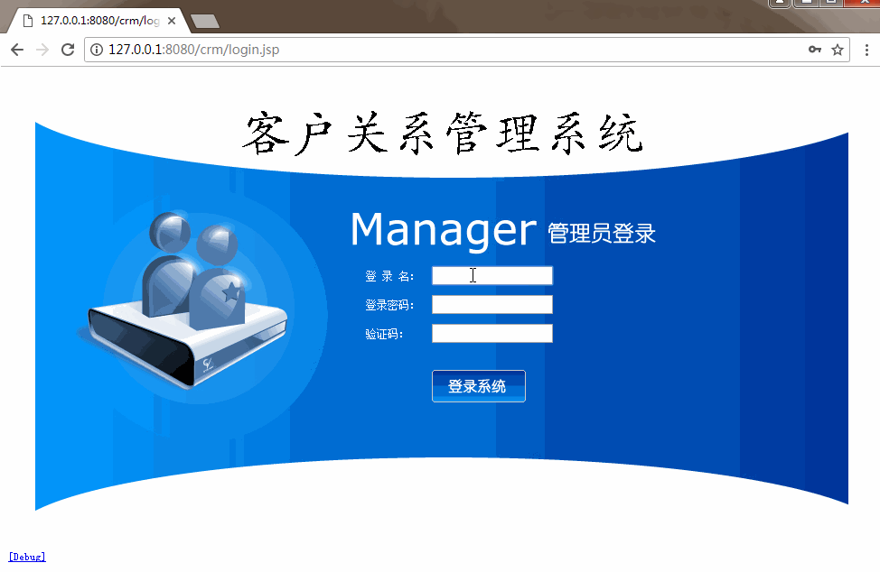
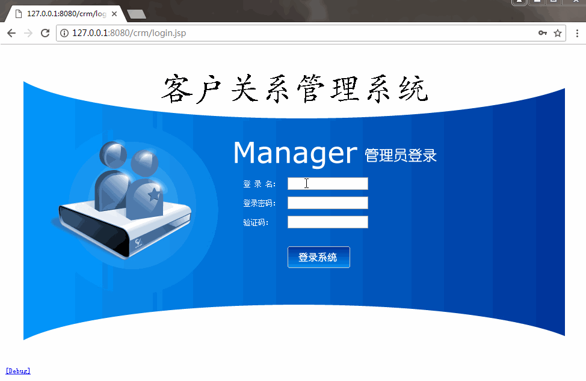

[TOC]

# SSH与SSM学习之SSH整合11——实现登录功能

## 一、导入所需要的文件

导入下面的文件


[https://github.com/wimingxxx/ssh_crm/tree/master/web/css](https://github.com/wimingxxx/ssh_crm/tree/master/web/css)


[https://github.com/wimingxxx/ssh_crm/tree/master/web/images](https://github.com/wimingxxx/ssh_crm/tree/master/web/images)


[https://github.com/wimingxxx/ssh_crm/tree/master/web/js](https://github.com/wimingxxx/ssh_crm/tree/master/web/js)


[https://github.com/wimingxxx/ssh_crm/tree/master/web/jsp](https://github.com/wimingxxx/ssh_crm/tree/master/web/jsp)


[https://github.com/wimingxxx/ssh_crm/tree/master/web/css](https://github.com/wimingxxx/ssh_crm/tree/master/web/css)


[https://github.com/wimingxxx/ssh_crm/tree/master/web/index.html](https://github.com/wimingxxx/ssh_crm/tree/master/web/index.html)


[https://github.com/wimingxxx/ssh_crm/tree/master/web/login.html](https://github.com/wimingxxx/ssh_crm/tree/master/web/login.html)


[https://github.com/wimingxxx/ssh_crm/tree/master/web/login.jsp](https://github.com/wimingxxx/ssh_crm/tree/master/web/login.jsp)


[https://github.com/wimingxxx/ssh_crm/tree/master/web/menu.jsp](https://github.com/wimingxxx/ssh_crm/tree/master/web/menu.jsp)


[https://github.com/wimingxxx/ssh_crm/tree/master/web/top.html](https://github.com/wimingxxx/ssh_crm/tree/master/web/top.html)


[https://github.com/wimingxxx/ssh_crm/tree/master/web/welcome.html](https://github.com/wimingxxx/ssh_crm/tree/master/web/welcome.html)

---

## 二、修改 UserServiceImpl 的 getUserByCodePassword 的方法

修改如下

```java
    @Override
    public User getUserByCodePassword(User u) {
        //1.根据登录名称查询登录用户
        //2.判断用户是否存在。不存在，抛出异常，提示：用户名不存在
        //3.判断用户登录密码是否正确。不正确，抛出异常，提示：密码错误
        //4.返回查询到的用户对象
        User existU = ud.getByUserCode(u.getUser_code());
        if(existU==null){
            throw new RuntimeException("用户名不存在");
        }
        if(!existU.getUser_password().equals(u.getUser_password())){
            throw new RuntimeException("密码错误");
        }
        return existU;
    }
```

---

## 三、UserAction修改

整体修改的UserAction如下

```java
package com.qwm.ssh_crm.web.action;

import com.opensymphony.xwork2.ActionContext;
import com.opensymphony.xwork2.ActionSupport;
import com.opensymphony.xwork2.ModelDriven;
import com.qwm.ssh_crm.domain.User;
import com.qwm.ssh_crm.service.UserService;

/**
 * @author：qiwenming
 * @date：2017/11/1 0001   23:37
 * @description：
 */
public class UserAction extends ActionSupport implements ModelDriven<User>{
    private User user = new User();

    private UserService userService;

    public String login() throws Exception{
        //1.调用Service执行登录逻辑
        User u = userService.getUserByCodePassword(user);
        //2.将返回的user对象放入到session域
        ActionContext.getContext().getSession().put("user",u);
        //3.重定向到项目首页
        return "toHome";
    }

    public void setUserService(UserService userService) {
        this.userService = userService;
    }

    @Override
    public User getModel() {
        return user;
    }
}
```

---

## 四、修改 struts.xml的配置

修改 UserAction的配置，如下

```xml
<?xml version="1.0" encoding="UTF-8" ?>
<!DOCTYPE struts PUBLIC
        "-//Apache Software Foundation//DTD Struts Configuration 2.5//EN"
        "http://struts.apache.org/dtds/struts-2.5.dtd">
<struts>
    <!-- 配置动态方法调用是否开启常量  默认是关闭的,需要开启-->
    <constant name="struts.enable.DynamicMethodInvocation" value="true"/>

    <!--
       struts.objectFactory = spring	将action的创建交给spring容器
        struts.objectFactory.spring.autoWire = name spring负责装配Action依赖属性 默认已经打开了-->
    <constant name="struts.objectFactory" value="spring"/>

    <package name="crm1" namespace="/" extends="struts-default">
        <!--全局允许方法调用-->
        <global-allowed-methods>regex:.*</global-allowed-methods>

        <global-exception-mappings>
            <exception-mapping result="error" exception="java.lang.RuntimeException"></exception-mapping>
        </global-exception-mappings>

        <!--class属性值，来自applicationContext.xml 中 Action的配置-->
        <action name="UserAction_*" class="userAction" method="{1}">
            <result name="toHome" type="redirect">/index.html</result>
            <result name="error">/login.jsp</result>
        </action>
    </package>
</struts>
```

---

## 五、测试

### 5.1 用户名错误测试


### 5.2 密码错误测试



### 5.3 登录成功测试




