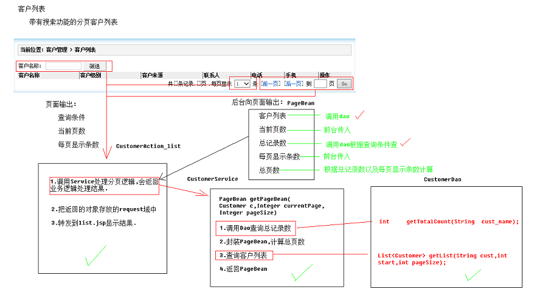

[TOC]

# SSH与SSM学习之SSH实现CRM练习01——客户列表01_客户列表分析

## 一、图示



具体的说明如下面所说。

---

## 二、页面输出和后台向页面输入

### 2.1 页面输出

页面输出，其实就是页面需要向后台提交哪些数据。

通过页面分析我们发现，其实页面只需要向后台提交下面的参数

```
查询条件---->来自客户名称的输入框

当前页数---->来自前一页、后一页或者到几页

每页显示条数--->来自每页显示几条
```

### 2.2 后台向页面输出

后台向页面输出的内容如下

```
客户列表 -----> 调用dao

当前页数 ------> 页面传入

总记录数 ------> 调用dao

每页显示条数---> 页面传入

总页数 --------> 根据总记录数和每页显示条数计算得到
```

---

## 三、Action

创建一个名叫做 CustomerAction 的Action ,提供一个 list 方法，用户获取列表数据。

这个list方法主要做以下事情

1. 调用Service处理 每页逻辑。返回业务需要的结果，就是上面 2.2的结果

2. 把返回的对象存入到request域中

3. 转发到list.jsp页面，显示结果


---

## 四、Service

创建一个名叫做 CustomerService 的 Service，提供一个 getPageBean的方法。方法定义如下

```java
public PageBean getPageBean(DetachedCriteria dc, Integer currentPage, Integer pageSize)
```

这个方法做以下事情

1. 调用Dao查询总记录数

2. 创建PageBean对象

3. 调用Dao查询分页数

4. 列表数据放入到PageBean中

5. 返回PageBean


----

## 五、DAO

创建一个名叫做 CustomerDao 的 Dao，提供如下的方法

```java
    //查询总记录数
    Integer getTotalCount(DetachedCriteria dc);
    //查询分页数据
    List<Customer> getPageList(DetachedCriteria dc, int start, Integer pageSize);
```


