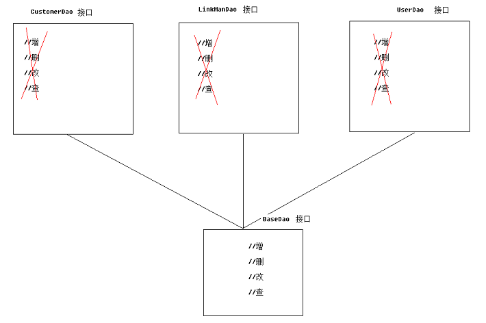
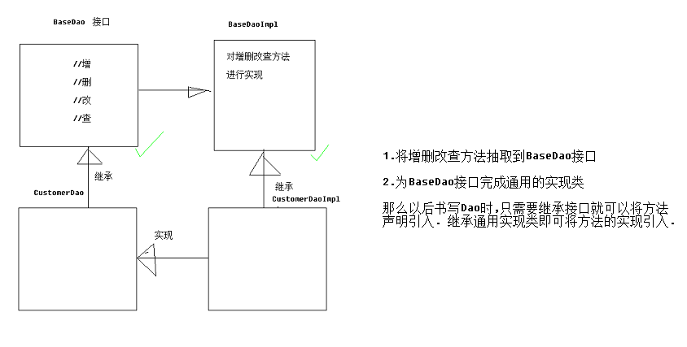

[TOC]

# SSH与SSM学习之SSH实现CRM练习07——BaseDao封装

## 一、抽取BaseDao

我们的每个DAO其实都是 CRUD 操作，其中很多代码是重复的，我们可以提取到BaseDao中，如下



---

## 二、BaseDao设计思路



如上图，我们的实现是这样的。

1. BaseDao中定义接口

2. BaseDaoImpl实现这些接口

3. 具体的Dao接口(如CustomerDao)继承 BaseDao接口

4. 具体的DaoImpl实现类(如CustomerDaoImpl),继承BaseImpl并且实现具体的Dao接口

---

## 三、BaseDao接口书写

```java
package com.qwm.ssh_crm.dao;

import org.hibernate.criterion.DetachedCriteria;

import java.io.Serializable;
import java.util.List;

/**
 * @author：qiwenming
 * @date：2017/11/5 0005   4:04
 * @description：
 * 公用的Dao
 */
public interface BaseDao<T> {
    //增
    void save(T t);
    //删
    void delete(T t);
    //删
    void delete(Serializable id);
    //改
    void update(T t);
    //查 根据id查询
    T getById(Serializable id);
    //查 符合条件的总记录数
    Integer	getTotalCount(DetachedCriteria dc);
    //查 查询分页列表数据
    List<T> getPageList(DetachedCriteria dc, Integer start, Integer pageSize);
}
```

---

## 四、BaseDao的实现类

```java
package com.qwm.ssh_crm.dao.impl;

import com.qwm.ssh_crm.dao.BaseDao;
import org.hibernate.criterion.DetachedCriteria;
import org.hibernate.criterion.Projections;
import org.springframework.orm.hibernate5.support.HibernateDaoSupport;

import java.io.Serializable;
import java.lang.reflect.ParameterizedType;
import java.util.List;

/**
 * @author：qiwenming
 * @date：2017/11/5 0005   4:07
 * @description：
 */
public class BaseDaoImpl<T> extends HibernateDaoSupport implements BaseDao<T>{

    protected Class clazz;//用于接收运行期泛型类型

    public BaseDaoImpl() {
        //获得当前类型的带有泛型类型的父类
        ParameterizedType ptClass = (ParameterizedType)this.getClass().getGenericSuperclass();
        //获得运行期的泛型类型
        clazz = (Class)ptClass.getActualTypeArguments()[0];
    }

    @Override
    public void save(T t) {
        getHibernateTemplate().save(t);
    }

    @Override
    public void delete(T t) {
        getHibernateTemplate().delete(t);
    }

    @Override
    public void delete(Serializable id) {
        //先取，再删
        T t = this.getById(id);
        getHibernateTemplate().delete(t);
    }

    @Override
    public void update(T t) {
        getHibernateTemplate().update(t);
    }

    @Override
    public T getById(Serializable id) {
        return (T)getHibernateTemplate().get(clazz,id);
    }

    @Override
    public Integer getTotalCount(DetachedCriteria dc) {
        //1.设置查询条件
        //2.查询
        //3.清空设置的聚合函数
        //4.判断返回
        dc.setProjection(Projections.rowCount());
        List<Long> list = (List<Long>)getHibernateTemplate().findByCriteria(dc);
        dc.setProjection(null);
        if(list!=null && list.size()>0){
            return list.get(0).intValue();
        }
        return null;
    }

    @Override
    public List<T> getPageList(DetachedCriteria dc, Integer start, Integer pageSize) {
        List<T> list = (List<T>) getHibernateTemplate().findByCriteria(dc,start,pageSize);
        return list;
    }
}
```

----

## 五、业务Dao中的应用

通过上面个改造，我们来看看我们的 **CustomerDao**。其他的Dao也是类似的。

### 5.1 CustomerDao

```java
package com.qwm.ssh_crm.dao;

import com.qwm.ssh_crm.domain.Customer;
import org.hibernate.criterion.DetachedCriteria;

import java.util.List;

/**
 * @author：qiwenming
 * @date：2017/11/5 0005   0:53
 * @description：
 */
public interface CustomerDao extends BaseDao<Customer>{
}
```

### 5.2 CustomerDaoImpl

```java
package com.qwm.ssh_crm.dao.impl;

import com.qwm.ssh_crm.dao.CustomerDao;
import com.qwm.ssh_crm.domain.Customer;

/**
 * @author：qiwenming
 * @date：2017/11/5 0005   0:55
 * @description：
 */
public class CustomerDaoImpl extends BaseDaoImpl<Customer> implements CustomerDao {
}
```

---------

## 六、源码下载

[https://github.com/wimingxxx/ssh_crm](https://github.com/wimingxxx/ssh_crm)