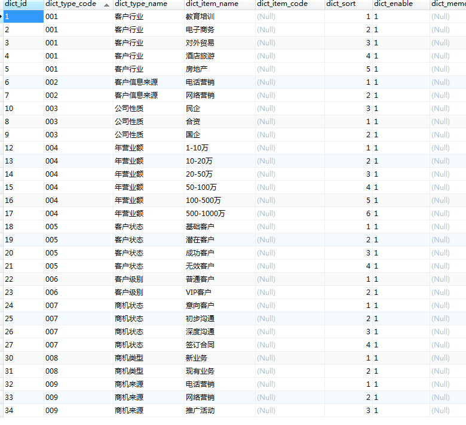
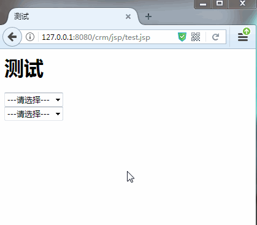

[TOC]

# SSH与SSM学习之SSH实现CRM练习08——数据字典表

## 一、数据字典表图示

在开发过程过，我们可能会使用到好多的枚举，或者说好多输入是选择其中的一个值的情况。

我们把这样的数据统一放到一个表中。

例如




---

## 二、数据字典表的sql 和 对应的实体类

### 2.1 sql

```sql
/*
SQLyog v10.2
MySQL - 5.1.72-community : Database - crm_hibernate
*********************************************************************
*/

/*!40101 SET NAMES utf8 */;

/*!40101 SET SQL_MODE=''*/;

/*!40014 SET @OLD_UNIQUE_CHECKS=@@UNIQUE_CHECKS, UNIQUE_CHECKS=0 */;
/*!40014 SET @OLD_FOREIGN_KEY_CHECKS=@@FOREIGN_KEY_CHECKS, FOREIGN_KEY_CHECKS=0 */;
/*!40101 SET @OLD_SQL_MODE=@@SQL_MODE, SQL_MODE='NO_AUTO_VALUE_ON_ZERO' */;
/*!40111 SET @OLD_SQL_NOTES=@@SQL_NOTES, SQL_NOTES=0 */;
/*Table structure for table `base_dict` */

CREATE TABLE `base_dict` (
  `dict_id` varchar(32) NOT NULL COMMENT '数据字典id(主键)',
  `dict_type_code` varchar(10) NOT NULL COMMENT '数据字典类别代码',
  `dict_type_name` varchar(64) NOT NULL COMMENT '数据字典类别名称',
  `dict_item_name` varchar(64) NOT NULL COMMENT '数据字典项目名称',
  `dict_item_code` varchar(10) DEFAULT NULL COMMENT '数据字典项目(可为空)',
  `dict_sort` int(10) DEFAULT NULL COMMENT '排序字段',
  `dict_enable` char(1) NOT NULL COMMENT '1:使用 0:停用',
  `dict_memo` varchar(64) DEFAULT NULL COMMENT '备注',
  PRIMARY KEY (`dict_id`)
) ENGINE=InnoDB DEFAULT CHARSET=utf8;

/*Data for the table `base_dict` */

LOCK TABLES `base_dict` WRITE;

insert  into `base_dict`(`dict_id`,`dict_type_code`,`dict_type_name`,`dict_item_name`,`dict_item_code`,`dict_sort`,`dict_enable`,`dict_memo`) values ('1','001','客户行业','教育培训 ',NULL,1,'1',NULL),('10','003','公司性质','民企',NULL,3,'1',NULL),('12','004','年营业额','1-10万',NULL,1,'1',NULL),('13','004','年营业额','10-20万',NULL,2,'1',NULL),('14','004','年营业额','20-50万',NULL,3,'1',NULL),('15','004','年营业额','50-100万',NULL,4,'1',NULL),('16','004','年营业额','100-500万',NULL,5,'1',NULL),('17','004','年营业额','500-1000万',NULL,6,'1',NULL),('18','005','客户状态','基础客户',NULL,1,'1',NULL),('19','005','客户状态','潜在客户',NULL,2,'1',NULL),('2','001','客户行业','电子商务',NULL,2,'1',NULL),('20','005','客户状态','成功客户',NULL,3,'1',NULL),('21','005','客户状态','无效客户',NULL,4,'1',NULL),('22','006','客户级别','普通客户',NULL,1,'1',NULL),('23','006','客户级别','VIP客户',NULL,2,'1',NULL),('24','007','商机状态','意向客户',NULL,1,'1',NULL),('25','007','商机状态','初步沟通',NULL,2,'1',NULL),('26','007','商机状态','深度沟通',NULL,3,'1',NULL),('27','007','商机状态','签订合同',NULL,4,'1',NULL),('3','001','客户行业','对外贸易',NULL,3,'1',NULL),('30','008','商机类型','新业务',NULL,1,'1',NULL),('31','008','商机类型','现有业务',NULL,2,'1',NULL),('32','009','商机来源','电话营销',NULL,1,'1',NULL),('33','009','商机来源','网络营销',NULL,2,'1',NULL),('34','009','商机来源','推广活动',NULL,3,'1',NULL),('4','001','客户行业','酒店旅游',NULL,4,'1',NULL),('5','001','客户行业','房地产',NULL,5,'1',NULL),('6','002','客户信息来源','电话营销',NULL,1,'1',NULL),('7','002','客户信息来源','网络营销',NULL,2,'1',NULL),('8','003','公司性质','合资',NULL,1,'1',NULL),('9','003','公司性质','国企',NULL,2,'1',NULL);

UNLOCK TABLES;

/*!40101 SET SQL_MODE=@OLD_SQL_MODE */;
/*!40014 SET FOREIGN_KEY_CHECKS=@OLD_FOREIGN_KEY_CHECKS */;
/*!40014 SET UNIQUE_CHECKS=@OLD_UNIQUE_CHECKS */;
/*!40111 SET SQL_NOTES=@OLD_SQL_NOTES */;
```

### 2.2 BaseDict

```java
package com.qwm.ssh_crm.domain;

/**
 * @author：qiwenming
 * @date：2017/11/5 0005   16:32
 * @description： 数据字典类
 */
public class BaseDict {
    /*
     * CREATE TABLE `base_dict` (
      `dict_id` varchar(32) NOT NULL COMMENT '数据字典id(主键)',
      `dict_type_code` varchar(10) NOT NULL COMMENT '数据字典类别代码',
      `dict_type_name` varchar(64) NOT NULL COMMENT '数据字典类别名称',
      `dict_item_name` varchar(64) NOT NULL COMMENT '数据字典项目名称',
      `dict_item_code` varchar(10) DEFAULT NULL COMMENT '数据字典项目(可为空)',
      `dict_sort` int(10) DEFAULT NULL COMMENT '排序字段',
      `dict_enable` char(1) NOT NULL COMMENT '1:使用 0:停用',
      `dict_memo` varchar(64) DEFAULT NULL COMMENT '备注',
      PRIMARY KEY (`dict_id`)
    ) ENGINE=InnoDB DEFAULT CHARSET=utf8;
     */

    private String dict_id;
    private String dict_type_code;
    private String dict_type_name;
    private String dict_item_name;
    private String dict_item_code;
    private String dict_memo;
    private Integer dict_sort;
    private Character dict_enable;

    ..............省略get/set方法......................
}

```

### 2.3 BaseDict.hbm.xml

```xml
<?xml version="1.0" encoding="UTF-8"?>
<!DOCTYPE hibernate-mapping PUBLIC
    "-//Hibernate/Hibernate Mapping DTD 3.0//EN"
    "http://www.hibernate.org/dtd/hibernate-mapping-3.0.dtd">

<hibernate-mapping package="com.qwm.ssh_crm.domain" >
	<class name="BaseDict" table="base_dict" >
		<id name="dict_id"  >
			<generator class="assigned"></generator>
		</id>
		<property name="dict_type_code" ></property>
		<property name="dict_type_name" ></property>
		<property name="dict_item_name" ></property>
		<property name="dict_item_code" ></property>
		<property name="dict_memo" ></property>
		<property name="dict_sort" ></property>
		<property name="dict_enable" ></property>
	</class>
</hibernate-mapping>
```


或者查看源码地址

[https://github.com/wimingxxx/ssh_crm/tree/master/src/com/qwm/ssh_crm/domain/BaseDict.java](https://github.com/wimingxxx/ssh_crm/tree/master/src/com/qwm/ssh_crm/domain/BaseDict.java)

[https://github.com/wimingxxx/ssh_crm/tree/master/src/com/qwm/ssh_crm/domain/BaseDict.hbm.xml](https://github.com/wimingxxx/ssh_crm/tree/master/src/com/qwm/ssh_crm/domain/BaseDict.hbm.xml)

---

## 三、数据字典表使用图示

这种数据，我们往往用来充当下拉的选择数据。如图



## 四、分析和实现

我们可以通过 js 去获取数据，然后，把它添加到给定 id 的控件上。

```js
/**
 * Created by Administrator on 2017/11/6 0006.
 */
//使用ajax加载数据字典,生成select
//参数1: 数据字典类型 (dict_type_code)
//参数2: 将下拉选放入的标签id
//参数3: 生成下拉选时,select标签的name属性值
//参数4: 需要回显时,选中哪个option
function loadSelect(typecode,positionId,selectname,selectedId) {
    //1.创建select对象，指定name属性
    //2.添加提示选项
    //3.使用jquery的ajax方法，访问后台的action
    //4.遍历json对象数据
    //5.把组装好的select对象放入页面指定位置
    var $select = $("<select name='"+selectname+"'></select>");
    $select.append($("<option value=''>---请选择---</option>"));
    $.post("${pageContext.request.contextPath}/BaseDictAction", { dict_type_code:typecode},
        function(data){
            $.each(data,function(index, value){
                var $option = $("<option value='"+value['dict_id']+"' >"+value["dict_item_name"]+"</option>");
                if(value['dict_id']==selectedId){
                    //判断是否需要回显 ,如果需要使其被选中
                    $option.attr("selected","selected");
                }
                //并添加到select对象
                $select.append($option);
            });
        }, "json");
    $("#"+positionId).append($select);
}
```

源码地址：

[https://github.com/wimingxxx/ssh_crm/blob/master/web/js/my.js](https://github.com/wimingxxx/ssh_crm/blob/master/web/js/my.js)

使用的时候添加到页面中

```jsp
<%--
  Created by IntelliJ IDEA.
  User: Administrator
  Date: 2017/11/6 0006
  Time: 22:07
  To change this template use File | Settings | File Templates.
--%>
<%@ page contentType="text/html;charset=UTF-8" language="java" %>
<html>
<head>
    <title>测试</title>
    <link href="${pageContext.request.contextPath}">
    <script type="text/javascript" src="${pageContext.request.contextPath }/js/jquery-1.4.4.min.js"></script>
    <script type="text/javascript" src="${pageContext.request.contextPath }/js/my.js"></script>
    <script type="text/javascript">
        $(document).ready(function () {
            loadSelect("004", "div", "cust_level.dict_id", "1");
            loadSelect("006", "span", "cust_level.dict_id", "1");
        });
    </script>
</head>
<body>

<h1>测试</h1>

<span id="span"/>

<div id="div"></div>

</body>
</html>
```

源码地址：

[https://github.com/wimingxxx/ssh_crm/blob/master/web/jsp/test.jsp](https://github.com/wimingxxx/ssh_crm/blob/master/web/jsp/test.jsp)


-------

## 五、源码下载

[https://github.com/wimingxxx/ssh_crm](https://github.com/wimingxxx/ssh_crm)