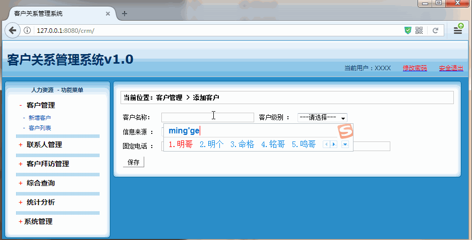
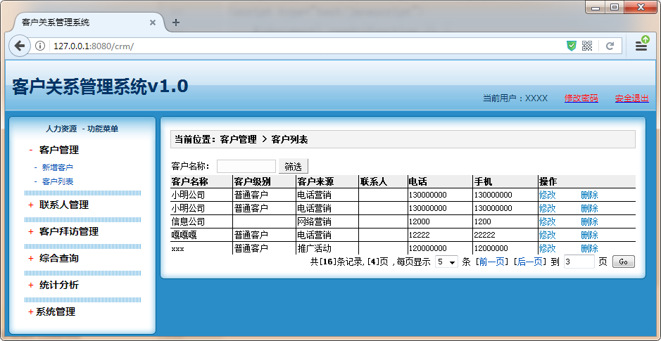

[TOC]

# SSH与SSM学习之SSH实现CRM练习09——新增客户

## 一、新增客户图示




---

## 二、Customer实体类主要修改

修改如下

Customer.java

```java
public class Customer {

	private Long cust_id;

	private String cust_name;
	private String cust_linkman;
	private String cust_phone;
	private String cust_mobile;
	//引用关联的数据字典对象
	private BaseDict cust_source; //客户来源 cust_source.dict_id
	private BaseDict cust_industry; //客户行业
	private BaseDict cust_level; //客户级别
	..............省略get/set方法......................
}
```

Customer.hbm.xml

```xml
<?xml version="1.0" encoding="UTF-8"?>
<!DOCTYPE hibernate-mapping PUBLIC
    "-//Hibernate/Hibernate Mapping DTD 3.0//EN"
    "http://www.hibernate.org/dtd/hibernate-mapping-3.0.dtd">
<hibernate-mapping package="com.qwm.ssh_crm.domain" >

	<class name="Customer" table="cst_customer" >

		<id name="cust_id"  >
			<generator class="native"></generator>
		</id>

		<property name="cust_name" column="cust_name" />
		<property name="cust_linkman" column="cust_linkman" ></property>
		<property name="cust_phone" column="cust_phone" ></property>
		<property name="cust_mobile" column="cust_mobile" ></property>

		<!--多对一-->
		<many-to-one name="cust_source" column="cust_source" class="BaseDict"></many-to-one>
		<many-to-one name="cust_industry" column="cust_industry" class="BaseDict"></many-to-one>
		<many-to-one name="cust_level" column="cust_level" class="BaseDict"></many-to-one>
	</class>
</hibernate-mapping>
```

或者查看源码地址

[https://github.com/wimingxxx/ssh_crm/tree/master/src/com/qwm/ssh_crm/domain/Customer.java](https://github.com/wimingxxx/ssh_crm/tree/master/src/com/qwm/ssh_crm/domain/Customer.java)

[https://github.com/wimingxxx/ssh_crm/tree/master/src/com/qwm/ssh_crm/domain/Customer.hbm.xml](https://github.com/wimingxxx/ssh_crm/tree/master/src/com/qwm/ssh_crm/domain/Customer.hbm.xml)

----

## 三、添加用户的jsp主要如下

其实主要就是添加js的方法

```jsp
<%@ page language="java" contentType="text/html; charset=UTF-8"
    pageEncoding="UTF-8"%>
<%@ taglib uri="http://java.sun.com/jsp/jstl/core" prefix="c" %>
<!DOCTYPE html PUBLIC "-//W3C//DTD HTML 4.01 Transitional//EN" "http://www.w3.org/TR/html4/loose.dtd">
<html>
<head>
<TITLE>添加客户</TITLE>
<meta http-equiv="Content-Type" content="text/html; charset=UTF-8">
<LINK href="${pageContext.request.contextPath }/css/Style.css" type=text/css rel=stylesheet>
<LINK href="${pageContext.request.contextPath }/css/Manage.css" type=text/css
	rel=stylesheet>
<script type="text/javascript" src="${pageContext.request.contextPath }/js/jquery-1.4.4.min.js"></script>
<script type="text/javascript" src="${pageContext.request.contextPath }/js/my.js"></script>
<script type="text/javascript">
	$(document).ready(function () {
		loadSelect("006","level","cust_level.dict_id",null);
        loadSelect("001","industry","cust_industry.dict_id",null);
        loadSelect("009","source","cust_source.dict_id",null);
    });
</script>

<META content="MSHTML 6.00.2900.3492" name=GENERATOR>
</HEAD>
<BODY>
  ................省略了代码.............
</BODY>
</html>
```

可以查看源文件

[https://github.com/wimingxxx/ssh_crm/blob/master/web/jsp/customer/add.jsp](https://github.com/wimingxxx/ssh_crm/blob/master/web/jsp/customer/add.jsp)


----

## 五、客户列表修改

客户列表的显示如下



主要就是修改 **客户级别和客户来源**

```jsp
...

    <TD>
        <s:property value="#cust.cust_level.dict_item_name"/>
    </TD>
    <TD>
        <s:property value="#cust.cust_source.dict_item_name"/>
    </TD>
...

```

可以查看源文件
[https://github.com/wimingxxx/ssh_crm/blob/master/web/jsp/customer/list.jsp](https://github.com/wimingxxx/ssh_crm/blob/master/web/jsp/customer/list.jsp)

----

## 六、源码下载

[https://github.com/wimingxxx/ssh_crm](https://github.com/wimingxxx/ssh_crm)