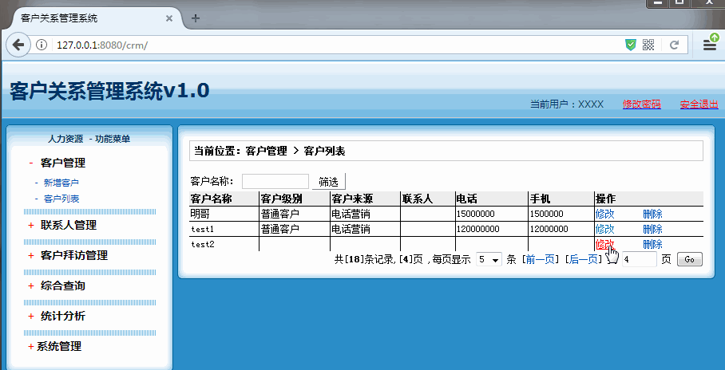
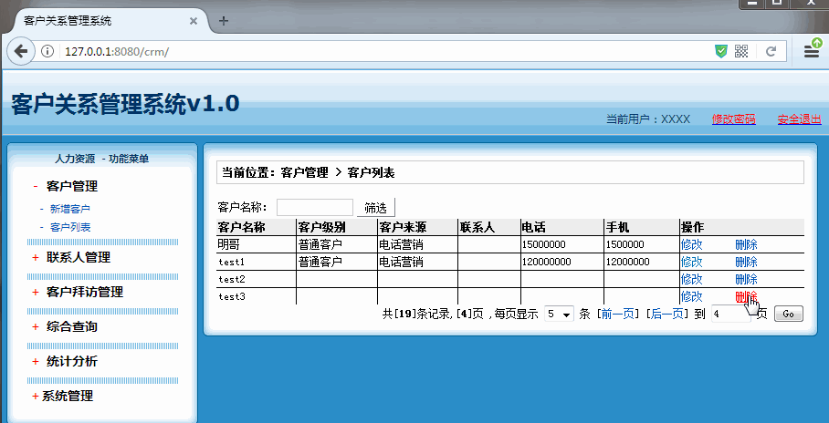

[TOC]

# SSH与SSM学习之SSH实现CRM练习10——编辑客户和删除客户

## 一、编辑客户图示



---

## 二、删除客户图示



---

## 三、编辑客户操作

编辑客户，其实就是对已经存在的客户进行编辑。这样我们我们编辑的界面还是使用新增客户的界面。

编辑客户
> 第一，我们的Action提供编辑的方法 （toEdit）
>
> 第二，Service 提供edit方法
>
> 第三，DAO 提供更新的方法（其实已经存在了 saveOrUpdate）
>
> 第四，对add.jsp界面进行修改
> 
> 第五，对list.jsp界面编辑按钮修改

### 3.1 CustomerAction

```java

/**
 * @author：qiwenming
 * @date：2017/11/5 0005   0:34
 * @description：
 * 用户相关Action
 */
public class CustomerAction extends ActionSupport implements ModelDriven<Customer>{

    ............

    public String toEdit() throws Exception {

        //1 获取 id 对应的用户
        Customer cust =cs.getById(customer.getCust_id());
        //2 把用户添加到 域中
        ActionContext.getContext().put("customer",cust);
        //3 并转发到编辑页面
        return "edit";
    }

    public String delete() throws Exception{
        cs.delete(customer.getCust_id());
        return "list";
    }
    ............

}
```

源码位置

[https://github.com/wimingxxx/ssh_crm/blob/master/src/com/qwm/ssh_crm/web/action/CustomerAction.java](https://github.com/wimingxxx/ssh_crm/blob/master/src/com/qwm/ssh_crm/web/action/CustomerAction.java)


### 3.2 CustomerService

**CustomerService**

```java
/**
 * @author：qiwenming
 * @date：2017/11/5 0005   0:45
 * @description：
 * 客户
 */
public interface CustomerService {
    ....
    Customer getById(Long cust_id);
    void delete(Long cust_id);
    ....
}
```

**CustomerServiceImpl**

```java
/**
 * @author：qiwenming
 * @date：2017/11/5 0005   0:47
 * @description：
 */
public class CustomerServiceImpl implements CustomerService {

    ....

    @Override
    public Customer getById(Long cust_id) {
        return cd.getById(cust_id);
    }
    
    @Override
    public void delete(Long cust_id) {
        cd.delete(cust_id);
    }
	.....
}
```

源码位置

[https://github.com/wimingxxx/ssh_crm/blob/master/src/com/qwm/ssh_crm/service/CustomerService.java](https://github.com/wimingxxx/ssh_crm/blob/master/src/com/qwm/ssh_crm/service/CustomerService.java)

[https://github.com/wimingxxx/ssh_crm/blob/master/src/com/qwm/ssh_crm/service/impl/CustomerServiceImpl.java](https://github.com/wimingxxx/ssh_crm/blob/master/src/com/qwm/ssh_crm/service/impl/CustomerServiceImpl.java)


### 3.3 add.jsp 主要修改

对应add.jsp 主要修改是这样的

1. 涉及到 之前是“添加用户”的地方，通过判断，来确认是 “添加用户”，还是“修改用户”
例如

```html
.....
<TITLE><s:property value="#customer==null?'添加':'修改'" />客户</TITLE>
....

<TD class=manageHead>当前位置：客户管理 &gt; <s:property value="#customer==null?'添加':'修改'" />客户</TD>

.....

```

2. 提价的内容字段，需要加入初始值。例如

```html

...............

    <TABLE cellSpacing=0 cellPadding=5  border=0>
      
        
        <TR>
            <td>客户名称：</td>
            <td>
            <INPUT class=textbox id=sChannel2
                                    style="WIDTH: 180px" maxLength=50 name="cust_name"
                            value="<s:property value="#customer.cust_name" />">
            </td>
            <td>客户级别 ：</td>
            <td id="level">
            </td>
        </TR>
        
        <TR>
            
            <td>信息来源 ：</td>
            <td id="source"></td>
            <td>客户行业：</td>
            <td id="industry">
            </td>
        </TR>
        
        <TR>
            
            
            <td>固定电话 ：</td>
            <td>
            <INPUT class=textbox id=sChannel2
                                    style="WIDTH: 180px" maxLength=50 name="cust_phone"
                   value="<s:property value="#customer.cust_phone" />">
            </td>
            <td>移动电话 ：</td>
            <td>
            <INPUT class=textbox id=sChannel2
                                    style="WIDTH: 180px" maxLength=50 name="cust_mobile"
                   value="<s:property value="#customer.cust_mobile" />">
            </td>
        </TR>
        
        <tr>
            <td rowspan=2>
            <INPUT class=button id=sButton2 type=submit
                                    value=" 保存 " name=sButton2>
            </td>
        </tr>
    </TABLE>
 
 ...............   
    
```


3. 最主要的，还是要在隐藏域中加上cust_id

```html
<input type="hidden" name="cust_id" value="<s:property value="#customer.cust_id" />" />
```

 源码位置

[https://github.com/wimingxxx/ssh_crm/blob/master/web/jsp/customer/add.jsp](https://github.com/wimingxxx/ssh_crm/blob/master/web/jsp/customer/add.jsp)


### 3.4 修改 list.jsp 中的修改按钮

```html
.....
 <a href="${pageContext.request.contextPath }/CustomerAction_toEdit?cust_id=<s:property value="#cust.cust_id"/>">修改</a>
....
```

 源码位置

[https://github.com/wimingxxx/ssh_crm/blob/master/web/jsp/customer/list.jsp](https://github.com/wimingxxx/ssh_crm/blob/master/web/jsp/customer/list.jsp)

----


## 四、删除客户

这个操作和上面基本一致，方法的修改在上面已经弄好了，主要就是，修改不 list.jsp的 删除按钮

```html
.......
<a href="${pageContext.request.contextPath }/CustomerAction_delete?cust_id=<s:property value="#cust.cust_id"/>">删除</a>
.......
```

 源码位置

[https://github.com/wimingxxx/ssh_crm/blob/master/web/jsp/customer/list.jsp](https://github.com/wimingxxx/ssh_crm/blob/master/web/jsp/customer/list.jsp)