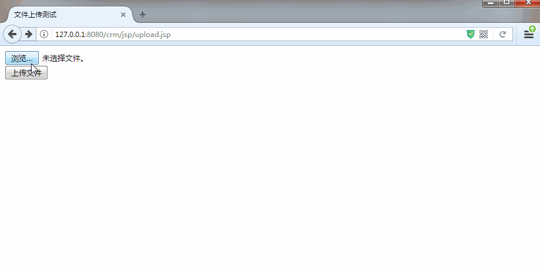
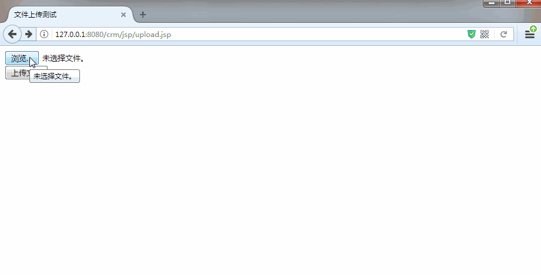

[TOC]

# SSH与SSM学习之SSH实现CRM练习11——文件上传

## 一、说明

这里我们使用 struts的文件上传功能。仅仅是演示文件上传。

之前我们使用的文件上传是原始的，例如

[https://github.com/qiwenming/iOSTestApi/blob/master/src/com/qwm/iostestapi/servlet/UploadFileServlet.java](https://github.com/qiwenming/iOSTestApi/blob/master/src/com/qwm/iostestapi/servlet/UploadFileServlet.java)


文件上传页面3个要求:
> 1.表单必须post提交
>
> 2.表单提交类型enctype.必须多段式.
>
> 3.文件上传使用 \<input type="file" /> 组件

---

## 二、upload.jsp

```jsp
<%--
  Created by IntelliJ IDEA.
  User: Administrator
  Date: 2017/11/30 0030
  Time: 23:16
  To change this template use File | Settings | File Templates.
--%>
<%@ page contentType="text/html;charset=UTF-8" language="java" %>
<%@ taglib prefix="s" uri="/struts-tags" %>
<html>
<head>
    <title>文件上传测试</title>
</head>
<body>

<form action="${pageContext.request.contextPath }/UploadFileAction"
      method="post" enctype="multipart/form-data">

    <input type="file" name="upFile"/>

    <br>

    <input type="submit" value="上传文件"><br>


    <s:property value="#uprb.message"/><br>
    <s:property value="#uprb.filePath"/><br>
    <s:property value="#uprb.mime"/><br>

</form>

</body>
</html>

```

源码位置

[https://github.com/wimingxxx/ssh_crm/blob/master/web/jsp/upload.jsp](https://github.com/wimingxxx/ssh_crm/blob/master/web/jsp/upload.jsp)


----

## 三、UploadFileAction说明

要实现文件上传，Action的书写特别简单

在 Action 中 定义一个属性，类型是 File,名字和上面jsp中 input 的名字相同。提供get/set方法，这样就可以上传了。

文件的名称加上特定的后缀，可以得到相应的值，例如

```java
    //上传的文件会自动封装到File对象
    //在后台提供一个与前台input type=file组件 name相同的属性
    private File upFile;

    //在提交键名后加上固定后缀FileName,文件名称会自动封装到属性中
    private String upFileFileName;

    //在提交键名后加上固定后缀ContentType,文件MIME类型会自动封装到属性中
    private String upFileContentType;
```

完整的 UploadFileAction 如下

```java
package com.qwm.ssh_crm.web.action;

import com.opensymphony.xwork2.ActionContext;
import com.opensymphony.xwork2.ActionSupport;
import com.qwm.ssh_crm.domain.UploadResponseBean;
import com.qwm.ssh_crm.utils.Md5Utils;
import org.apache.struts2.ServletActionContext;

import java.io.File;

public class UploadFileAction extends ActionSupport{

    private String mUploadDir = "/upload";

    //上传的文件会自动封装到File对象
    //在后台提供一个与前台input type=file组件 name相同的属性
    private File upFile;
    //在提交键名后加上固定后缀FileName,文件名称会自动封装到属性中
    private String upFileFileName;
    //在提交键名后加上固定后缀ContentType,文件MIME类型会自动封装到属性中
    private String upFileContentType;

    public String uploadFile(){
        UploadResponseBean uprb = new UploadResponseBean();
        if(upFile==null){
            uprb.setMessage("图片不能为空");
            ActionContext.getContext().put("uprb",uprb);
            return SUCCESS;
        }
        String savePath = ServletActionContext.getRequest().getRealPath(mUploadDir);
        //判断文件夹是否存在，不存在创建
        File saveDir = new File(savePath);
        if(!saveDir.exists()){
            saveDir.mkdir();
        }
        String filename = Md5Utils.md5Encode(upFileFileName) + "." +upFileFileName.substring( upFileFileName.lastIndexOf(".")+1 );
        //保存文件
        upFile.renameTo(new File(saveDir+"/"+filename));

        String filePath = mUploadDir+"/"+filename;
        uprb.setMessage("图片上传成功");
        uprb.setFilePath(filePath);
        uprb.setMime(upFileContentType);
        ActionContext.getContext().put("uprb",uprb);
        return SUCCESS;
    }

    public File getUpFile() {
        return upFile;
    }

    public void setUpFile(File upFile) {
        this.upFile = upFile;
    }

    public String getUpFileFileName() {
        return upFileFileName;
    }

    public void setUpFileFileName(String upFileFileName) {
        this.upFileFileName = upFileFileName;
    }

    public String getUpFileContentType() {
        return upFileContentType;
    }

    public void setUpFileContentType(String upFileContentType) {
        this.upFileContentType = upFileContentType;
    }
}

```

源码位置

[https://github.com/wimingxxx/ssh_crm/blob/master/src/com/qwm/ssh_crm/web/action/UploadFileAction.java](https://github.com/wimingxxx/ssh_crm/blob/master/src/com/qwm/ssh_crm/web/action/UploadFileAction.java)

----

## 四、UploadFileAction配置

### 4.1 ApplicaitonContext.xml中配置

添加如下配置

```xml
    <bean name="uploadFileAction" class="com.qwm.ssh_crm.web.action.UploadFileAction" scope="prototype">
    </bean>
```

源码位置

[https://github.com/wimingxxx/ssh_crm/blob/master/src/applicationContext.xml](https://github.com/wimingxxx/ssh_crm/blob/master/src/applicationContext.xml)

### 4.2 struts.xml中配置

添加如下配置

```xml
        <action name="UploadFileAction" class="uploadFileAction" method="uploadFile">
            <result name="success"  >/jsp/upload.jsp</result>
        </action>
```

源码位置

[https://github.com/wimingxxx/ssh_crm/blob/master/src/struts.xml](https://github.com/wimingxxx/ssh_crm/blob/master/src/struts.xml)

----
## 五、演示

### 5.1 没有选择文件上传的情况



### 5.2 上传成功的情况



---

## 六、源码下载

[https://github.com/wimingxxx/ssh_crm](https://github.com/wimingxxx/ssh_crm)
