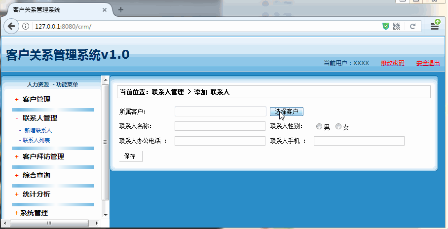

[TOC]

# SSH与SSM学习之SSH实现CRM练习13——添加联系人

## 一、添加联系人演示



---


## 二、 添加联系人分析

添加联系人其实和添加客户时一样的，唯一不同的地方就是，**选择客户**的时候，是通过打开一个弹框

来是实现的，然后弹框选择以后，自动把值显示到添加联系人界面上来，最后关闭这个弹框。


---

## 三、弹框的实现

### 3.1 window的open方法

弹框主要使用到**js**的如下方法：

```js
window.open(URL,name,features,replace)
```

|参数 |描述|
|---|----|
|URL | 一个可选的字符串，声明了要在新窗口中显示的文档的 URL。如果省略了这个参数，或者它的值是空字符串，那么新窗口就不会显示任何文档。|
|name | 一个可选的字符串，该字符串是一个由逗号分隔的特征列表，其中包括数字、字母和下划线，该字符声明了新窗口的名称。这个名称可以用作标记 <a> 和 <form> 的属性 target 的值。如果该参数指定了一个已经存在的窗口，那么 open() 方法就不再创建一个新窗口，而只是返回对指定窗口的引用。在这种情况下，features 将被忽略。|
|features | 一个可选的字符串，声明了新窗口要显示的标准浏览器的特征。如果省略该参数，新窗口将具有所有标准特征。在窗口特征这个表格中，我们对该字符串的格式进行了详细的说明。|
|replace |一个可选的布尔值。规定了装载到窗口的 URL 是在窗口的浏览历史中创建一个新条目，还是替换浏览历史中的当前条目。<br>支持下面的值： <br>true - URL 替换浏览历史中的当前条目。 <br>false - URL 在浏览历史中创建新的条目。|

例如

```html
<html>
<head>
<script type="text/javascript">
    function open_win() {
      window.open('${pageContext.request.contextPath}/CustomerAction_list?select=true','','width=600,height=300');
    }
</script>
</head>
<body>

 <input type=button value="Open Window" onclick="open_win()" />

</body>
</html>
```

### 3.2 window的opener属性

 window 的 opener 属性，返回对创建此窗口的窗口的引用。

 比如我们在 **添加联系人**中打开了**客户列表** 弹框，那么我们在**客户列表**中通过window的opener属性拿到的就是 **添加联系人** 的window对象了。

 例如

 ```js
function selectCustomer(cust_id,cust_name) {
     //获取添加到页面的window对象（谁打开的）
     var win = window.opener;
     //获取添加页面的document对象
     var doc = win.document;
     //获取隐藏域和客户名称的div，赋值
     doc.getElementById("cust_id").value = cust_id;
     doc.getElementById("cust_name").value = cust_name;
     //关闭当前窗口
     window.close();
 }
 ```

 ---

## 四、LinkManAction

创建 LinkManAction，创建一个 add 方法，如下

 ```java
/**
 * @author：qiwenming
 * @date：2017/12/2 0002
 * @description：
 *   联系人的Action
 */
public class LinkManAction extends ActionSupport implements ModelDriven<LinkMan> {
    private LinkMan linkMan =new LinkMan();

    private LinkManService lms;


    public String add() throws Exception {
        //1 调用Service
        lms.save(linkMan);
        //2 重定向到联系人列表(404)
        return "toList";
    }


    @Override
    public LinkMan getModel() {
        return linkMan;
    }


    public LinkManService getLms() {
        return lms;
    }

    public void setLms(LinkManService lms) {
        this.lms = lms;
    }
}

 ```

源码位置

[https://github.com/wimingxxx/ssh_crm/tree/master/src/com/qwm/ssh_crm/web/action/LinkManAction.java](https://github.com/wimingxxx/ssh_crm/tree/master/src/com/qwm/ssh_crm/web/action/LinkManAction.java)

---

## 五、LinkManService

### 5.1 LinkManService

```java
/**
 * @author：qiwenming
 * @date：2017/12/2 0002
 * @description：
 * 联系人的Service
 */
public interface LinkManService {
    void save(LinkMan linkMan);
}
```

### 5.2 LinkManServiceImpl

```java
/**
 * @author：qiwenming
 * @date：2017/12/2 0002
 * @description：
 * 联系人的Service
 */
public class LinkManServiceImpl implements LinkManService{
    private LinkManDao lmd;
    @Override
    public void save(LinkMan linkMan) {
        lmd.saveOrUpdate(linkMan);
    }

     public LinkManDao getLmd() {
         return lmd;
     }

     public void setLmd(LinkManDao lmd) {
         this.lmd = lmd;
     }
 }
```

源码下载

[https://github.com/wimingxxx/ssh_crm/blob/master/src/com/qwm/ssh_crm/service/LinkManService.java](https://github.com/wimingxxx/ssh_crm/blob/master/src/com/qwm/ssh_crm/service/impl/LinkManServiceImpl.java)

[https://github.com/wimingxxx/ssh_crm/blob/master/src/com/qwm/ssh_crm/service/LinkManService.java](https://github.com/wimingxxx/ssh_crm/blob/master/src/com/qwm/ssh_crm/service/impl/LinkManServiceImpl.java)

---

## 六、applicationContext.xml中添加配置

```xml
    <!--dao配置-->
    <bean name="linkManDao" class="com.qwm.ssh_crm.dao.impl.LinkManDaoImpl">
        <property name="sessionFactory" ref="sessionFactory"/>
    </bean>

    <!--Service配置-->
    <bean name="linkManService" class="com.qwm.ssh_crm.service.impl.LinkManServiceImpl">
        <property name="lmd" ref="linkManDao"/>
    </bean>

    <!--Action配置 手动组装依赖  必须配置为多例模式-->
    <bean name="linkManAction" class="com.qwm.ssh_crm.web.action.LinkManAction" scope="prototype">
        <property name="lms" ref="linkManService"/>
    </bean>
```

源码位置

[https://github.com/wimingxxx/ssh_crm/blob/master/src/applicationContext.xml](https://github.com/wimingxxx/ssh_crm/blob/master/src/applicationContext.xml)

## 七、struts.xml中添加配置
```xml
    <action name="LinkManAction_*" class="linkManAction" method="{1}">
        <result name="add"  >/jsp/linkman/add.jsp</result>
        <result name="list"  >/jsp/linkman/list.jsp</result>
        <result name="toList" type="redirectAction" >
            <param name="namespace">/</param>
            <param name="actionName">LinkManAction_list</param>
        </result>
    </action>
```

源码位置

[https://github.com/wimingxxx/ssh_crm/blob/master/src/struts.xml](https://github.com/wimingxxx/ssh_crm/blob/master/src/struts.xml)

----

## 八、源码下载

[https://github.com/wimingxxx/ssh_crm](https://github.com/wimingxxx/ssh_crm)