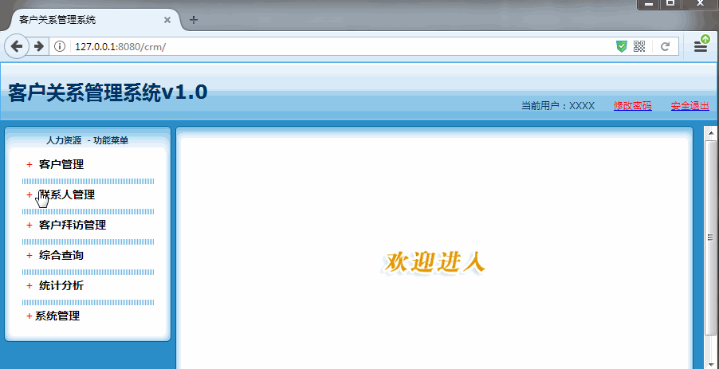
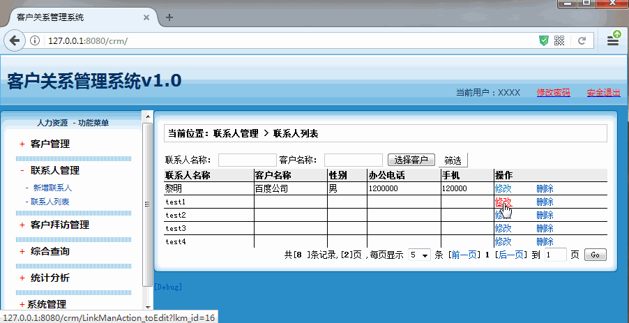

[TOC]

# SSH与SSM学习之SSH实现CRM练习14——联系人列表

## 一、联系人列表演示





------

## 二、联系人列表分析

这里列表和客户列表其实的操作其实是相同的。弹框的处理前面已经处理过。所以主要对我们的Action、Service等添加方法。


----

## 三、LinkManAction修改

    LinkManAction添加，添加 list() 、toEdit()、delete()方法以及添加属性，如下

```java
     /**
      * @author：qiwenming
      * @date：2017/12/2 0002
      * @description：
      *   联系人的Action
      */
     public class LinkManAction extends ActionSupport implements ModelDriven<LinkMan> {
     private LinkMan linkMan =new LinkMan();

           private LinkManService lms;

           private Integer currentPage;
           private Integer pageSize;

           public String list() throws Exception{
               //封装离线查询对象
               DetachedCriteria dc = DetachedCriteria.forClass(LinkMan.class);
               //判断并封装参数
               if(StringUtils.isNotBlank(linkMan.getLkm_name())){
                   dc.add(Restrictions.like("lkm_name", "%"+linkMan.getLkm_name()+"%"));
               }
               if(linkMan.getCustomer()!=null&&linkMan.getCustomer().getCust_id()!=null){
                   dc.add(Restrictions.eq("customer.cust_id", linkMan.getCustomer().getCust_id()));
               }

               //1 调用Service查询分页数据(PageBean)
               PageBean pb = lms.getPageBean(dc,currentPage,pageSize);
               //2 将PageBean放入request域,转发到列表页面显示
               ActionContext.getContext().put("pageBean", pb);
               return "list";
           }

           public String add() throws Exception {
               //1 调用Service
               lms.save(linkMan);
               //2 重定向到联系人列表(404)
               return "toList";
           }

           public String toEdit() throws Exception {
               //1 调用Service,查询LinkMan
               LinkMan lm = lms.getById(linkMan.getLkm_id());
               //2 将查询的Linkman对象放入request域,转发到添加页面
               ActionContext.getContext().put("linkMan", lm);
               return "add";
           }

           public String delete() throws Exception {
               //1 调用Service
               lms.delete(linkMan.getLkm_id());
               //2 重定向到联系人列表(404)
               return "toList";
           }

           @Override
           public LinkMan getModel() {
               return linkMan;
           }


           public LinkManService getLms() {
               return lms;
           }

           public void setLms(LinkManService lms) {
               this.lms = lms;
           }

           public Integer getCurrentPage() {
               return currentPage;
           }

           public void setCurrentPage(Integer currentPage) {
               this.currentPage = currentPage;
           }

           public Integer getPageSize() {
               return pageSize;
           }

           public void setPageSize(Integer pageSize) {
               this.pageSize = pageSize;
           }
     }

```

源码位置

[https://github.com/wimingxxx/ssh_crm/tree/master/src/com/qwm/ssh_crm/web/action/LinkManAction.java](https://github.com/wimingxxx/ssh_crm/tree/master/src/com/qwm/ssh_crm/web/action/LinkManAction.java)

---

## 四、LinkManService

### 4.1 LinkManService

```java
/**
 * @author：qiwenming
 * @date：2017/12/2 0002
 * @description：
 * 联系人的Service
 */
public interface LinkManService {
    void save(LinkMan linkMan);
    PageBean getPageBean(DetachedCriteria dc, Integer currentPage, Integer pageSize);
    LinkMan getById(Long lkm_id);
    void delete(Long lkm_id);
}
```

### 4.2 LinkManServiceImpl

```java
/**
 * @author：qiwenming
 * @date：2017/12/2 0002
 * @description：
 * 联系人的Service
 */
public class LinkManServiceImpl implements LinkManService{
    private LinkManDao lmd;
    @Override
    public void save(LinkMan linkMan) {
        lmd.saveOrUpdate(linkMan);
    }

    @Override
    public PageBean getPageBean(DetachedCriteria dc, Integer currentPage, Integer pageSize) {
        //1 调用Dao查询总记录数
        Integer totalCount = lmd.getTotalCount(dc);
        //2 创建PageBean对象
        PageBean pb = new PageBean(currentPage, totalCount, pageSize);
        //3 调用Dao查询分页列表数据

        List<LinkMan> list = lmd.getPageList(dc,pb.getStart(),pb.getPageSize());
        //4 列表数据放入pageBean中.并返回
        pb.setList(list);
        return pb;
    }

    @Override
    public LinkMan getById(Long lkm_id) {
        return lmd.getById(lkm_id);
    }

    @Override
    public void delete(Long lkm_id) {
        lmd.delete(lkm_id);
    }

    public LinkManDao getLmd() {
        return lmd;
    }

    public void setLmd(LinkManDao lmd) {
        this.lmd = lmd;
    }
}
```

源码位置

[https://github.com/wimingxxx/ssh_crm/blob/master/src/com/qwm/ssh_crm/service/LinkManService.java](https://github.com/wimingxxx/ssh_crm/blob/master/src/com/qwm/ssh_crm/service/impl/LinkManServiceImpl.java)

[https://github.com/wimingxxx/ssh_crm/blob/master/src/com/qwm/ssh_crm/service/LinkManService.java](https://github.com/wimingxxx/ssh_crm/blob/master/src/com/qwm/ssh_crm/service/impl/LinkManServiceImpl.java)

---

## 五、源码下载

[https://github.com/wimingxxx/ssh_crm](https://github.com/wimingxxx/ssh_crm)