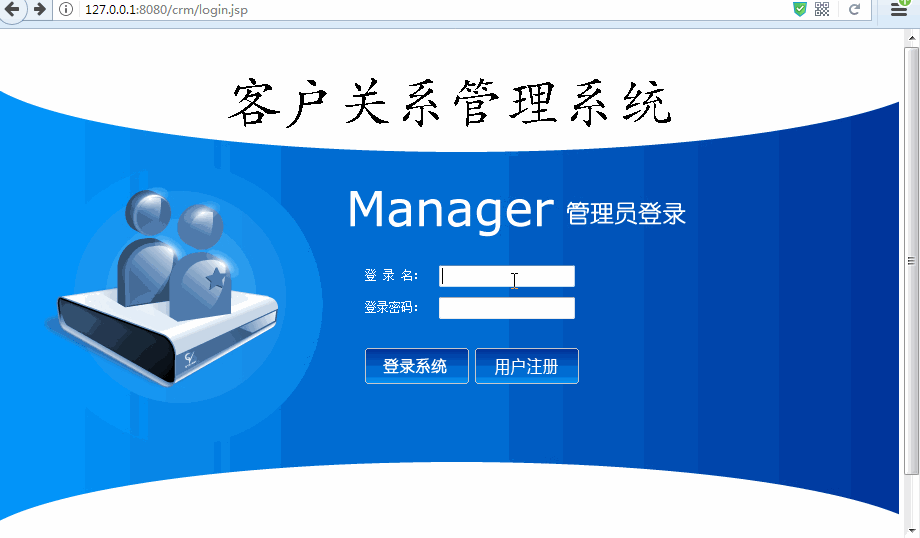

[TOC]

# SSH与SSM学习之SSH实现CRM练习15——注册登录

## 一、注册演示

### 1.1 用户名已经存在


### 1.2 注册成功


---

## 二、登录演示

### 2.1 用户名不存在


### 2.2 密码错误


### 2.3 登录成功



---

----

## 三、注册和登录实现

### 3.1 注册说明

注册其实主要的处理就是把页面的数据提交到 Action中，然后通过判断提交的用户是否已经存在，如果不存在就抛出异常，

提示用户已经存在。如果用户不存在，那么保存用户到数据库。

注册界面请看源码

[https://github.com/wimingxxx/ssh_crm/blob/master/web/regist.jsp](https://github.com/wimingxxx/ssh_crm/blob/master/web/regist.jsp)

### 3.2 登录说明

登录其实主要的处理就是把页面的数据提交到 Action中，然后通过判断提交的用户是否存在，如果不存在就抛出异常，

提示用户名不存在。如果存在，判断密码，如果密码错误，那么提示密码错误，如果密码正确，登录成功。

登录界面请看源码

[https://github.com/wimingxxx/ssh_crm/blob/master/web/login.jsp](https://github.com/wimingxxx/ssh_crm/blob/master/web/login.jsp)


### 3.3 UserAction

UserAction 主要就是注册和登录，如下

```java
/**
 * @author：qiwenming
 * @date：2017/11/1 0001   23:37
 * @description：
 */
public class UserAction extends ActionSupport implements ModelDriven<User>{
    private User user = new User();

    private UserService userService;

    public String login() throws Exception{
        //1.调用Service执行登录逻辑
        User u = userService.getUserByCodePassword(user);
        //2.将返回的user对象放入到session域
        ActionContext.getContext().getSession().put("user",u);
        //3.重定向到项目首页
        return "toHome";
    }

    public String regist() throws Exception{
        //1.调用Service保存注册用户
        try{
            userService.saveUser(user);
        }catch (Exception e) {
            e.printStackTrace();
            ActionContext.getContext().put("error", e.getMessage());
            return "regist";
        }
        return "toLogin";
    }

    public void setUserService(UserService userService) {
        this.userService = userService;
    }

    @Override
    public User getModel() {
        return user;
    }
}
```

### 3.4 UserService

#### 3.4.1 UserService

```java
/**
 * @author：qiwenming
 * @date：2017/11/2 0002   21:48
 * @description：
 */
public interface UserService {
    //登陆方法
    User getUserByCodePassword(User u);
    //注册用户
    void saveUser(User u);
}
```

#### 3.4.2 UserServiceImpl

```java
/**
 * @author：qiwenming
 * @date：2017/11/2 0002   21:48
 * @description：
 */

public class UserServiceImpl implements UserService {

    private UserDao ud;

    @Override
    public User getUserByCodePassword(User u) {
        //1.根据登录名称查询登录用户
        //2.判断用户是否存在。不存在，抛出异常，提示：用户名不存在
        //3.判断用户登录密码是否正确。不正确，抛出异常，提示：密码错误
        //4.返回查询到的用户对象
        User existU = ud.getByUserCode(u.getUser_code());
        if(existU==null){
            throw new RuntimeException("用户名不存在");
        }
        u.setUser_password(Md5Utils.md5Encode(u.getUser_password()));
        if(!existU.getUser_password().equals(u.getUser_password())){
            throw new RuntimeException("密码错误");
        }
        return existU;
    }

    @Override
    @Transactional(isolation = Isolation.REPEATABLE_READ,propagation = Propagation.REQUIRED,readOnly = false)
    public void saveUser(User u) {
        //1 调用Dao根据注册的登陆名获得用户对象
        //2 如果获得到user对象,用户名已经存在,抛出异常
        //3 使用MD5对密码进行加密
        //4 调用Dao执行保存
        User existU = ud.getByUserCode(u.getUser_code());
        if(existU!=null){
            throw new RuntimeException("用户名已经存在了");
        }
        u.setUser_password(Md5Utils.md5Encode(u.getUser_password()));
        ud.save(u);
    }

    public void setUd(UserDao ud) {
        this.ud = ud;
    }
}
```

---

## 四、applicationContext.xml中添加配置

```xml
......
    <!--dao配置-->
    <bean name="userDao" class="com.qwm.ssh_crm.dao.impl.UserDaoImpl">
        <property name="sessionFactory" ref="sessionFactory"/>
    </bean>

    <!--Service配置-->
    <bean name="userService" class="com.qwm.ssh_crm.service.impl.UserServiceImpl">
        <property name="ud" ref="userDao"/>
    </bean>

    <!--Action配置 手动组装依赖  必须配置为多例模式-->
    <bean name="userAction" class="com.qwm.ssh_crm.web.action.UserAction" scope="prototype">
        <property name="userService" ref="userService"/>
    </bean>
......
```

## 五、struts.xml中添加配置

```xml
.....
    <!--class属性值，来自applicationContext.xml 中 Action的配置-->
    <action name="UserAction_*" class="userAction" method="{1}">
        <result name="toHome" type="redirect">/index.html</result>
        <result name="error">/login.jsp</result>
        <result name="regist" >/regist.jsp</result>
    </action>
.....

```

---

## 六、源码下载

[https://github.com/wimingxxx/ssh_crm](https://github.com/wimingxxx/ssh_crm)