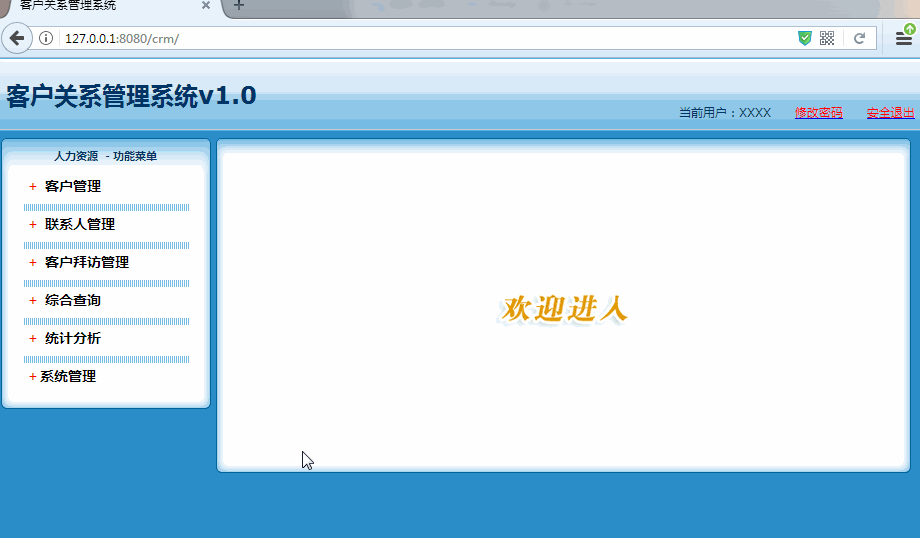

[TOC]

# SSH与SSM学习之SSH实现CRM练习16——登录校验拦截器

## 一、图示

除了调用登录、注册、上传文件（因为这个单独的，和其他没关），这三个方法外，其他的方法调用的时候

都需要登录验证。主要的操作方式就是通过拦截器来实现的。



----

## 二、PrivilegeInterceptor

```java
/**
 * @author：qiwenming
 * @date：2017/12/3 0003
 * @description：
 * 登录的验证
 */
public class PrivilegeInterceptor extends MethodFilterInterceptor {

    //不校验登陆和注册方法
    @Override
    protected String doIntercept(ActionInvocation invocation) throws Exception {
        //1 获取session
        //2 获取登录标识
        //3 判断标识是否存在
        Map<String,Object> session = ActionContext.getContext().getSession();
        User user = (User)session.get("user");
        if(user!=null){
            //存在-->放行
            return invocation.invoke();
        }else {
            //不存在---> 重定向到登陆页面
            return "toLogin";
        }
    }
}
```

---

## 三、PrivilegeInterceptor配置

主要在 struts.xml 中添加如下配置

```xml
  ...................
       <interceptors>
            <!-- 注册拦截器 -->
            <interceptor name="privilegeInterceptor" class="com.qwm.ssh_crm.web.intercreptor.PrivilegeInterceptor"></interceptor>
            <!-- 配置拦截器栈 -->
            <interceptor-stack name="myStack">
                <interceptor-ref name="privilegeInterceptor">
                    <param name="excludeMethods">login,regist,uploadFile</param>
                </interceptor-ref>
                <interceptor-ref name="defaultStack"></interceptor-ref>
            </interceptor-stack>
            <!-- 指定默认拦截器栈 -->
        </interceptors>
        <!-- 指定默认拦截器栈 -->
        <default-interceptor-ref name="myStack"></default-interceptor-ref>
  ...................
```

----

## 四、struts.xml 配置说明

struts.xml 中的 **package**中配置的顺序是有要求的，如下：

```xml
result-types?

interceptors?

default-interceptor-ref?,

default-action-ref?

default-class-ref?

global-results?

global-allowed-methods?

global-exception-mappings?,

action*
```

如果不按这个顺序配置，会出错的。

struts.xml的配置如下

```xml
<?xml version="1.0" encoding="UTF-8" ?>
<!DOCTYPE struts PUBLIC
        "-//Apache Software Foundation//DTD Struts Configuration 2.5//EN"
        "http://struts.apache.org/dtds/struts-2.5.dtd">
<struts>
    <!-- 配置动态方法调用是否开启常量  默认是关闭的,需要开启-->
    <constant name="struts.enable.DynamicMethodInvocation" value="true"/>

    <!--
       struts.objectFactory = spring	将action的创建交给spring容器
        struts.objectFactory.spring.autoWire = name spring负责装配Action依赖属性 默认已经打开了-->
    <constant name="struts.objectFactory" value="spring"/>

    <package name="crm1" namespace="/" extends="struts-default">

        <interceptors>
            <!-- 注册拦截器 -->
            <interceptor name="privilegeInterceptor" class="com.qwm.ssh_crm.web.intercreptor.PrivilegeInterceptor"></interceptor>
            <!-- 配置拦截器栈 -->
            <interceptor-stack name="myStack">
                <interceptor-ref name="privilegeInterceptor">
                    <param name="excludeMethods">login,regist,uploadFile</param>
                </interceptor-ref>
                <interceptor-ref name="defaultStack"></interceptor-ref>
            </interceptor-stack>
            <!-- 指定默认拦截器栈 -->
        </interceptors>
        <!-- 指定默认拦截器栈 -->
        <default-interceptor-ref name="myStack"></default-interceptor-ref>

        <!-- 全局结果集配置 -->
        <global-results>
            <result name="toLogin" type="redirect" >/login.jsp</result>
        </global-results>
        <!--全局允许方法调用-->
        <global-allowed-methods>regex:.*</global-allowed-methods>
        <global-exception-mappings>
            <exception-mapping result="error" exception="java.lang.RuntimeException"></exception-mapping>
        </global-exception-mappings>

        <!--class属性值，来自applicationContext.xml 中 Action的配置-->
        <action name="UserAction_*" class="userAction" method="{1}">
            <result name="toHome" type="redirect">/index.html</result>
            <result name="error">/login.jsp</result>
            <result name="regist" >/regist.jsp</result>
        </action>

        <action name="CustomerAction_*" class="customerAction" method="{1}">
            <result name="edit"  >/jsp/customer/add.jsp</result>
            <result name="list"  >/jsp/customer/list.jsp</result>
            <result name="toList" type="redirectAction" >
                <param name="namespace">/</param>
                <param name="actionName">CustomerAction_list</param>
            </result>
        </action>

        <action name="BaseDictAction" class="baseDictAction" method="execute"/>

        <action name="UploadFileAction" class="uploadFileAction" method="uploadFile">
            <result name="success"  >/jsp/upload.jsp</result>
        </action>

        <action name="LinkManAction_*" class="linkManAction" method="{1}">
            <result name="add"  >/jsp/linkman/add.jsp</result>
            <result name="list"  >/jsp/linkman/list.jsp</result>
            <result name="toList" type="redirectAction" >
                <param name="namespace">/</param>
                <param name="actionName">LinkManAction_list</param>
            </result>
        </action>
    </package>
</struts>
```

---

## 五、源码下载

[https://github.com/wimingxxx/ssh_crm](https://github.com/wimingxxx/ssh_crm)