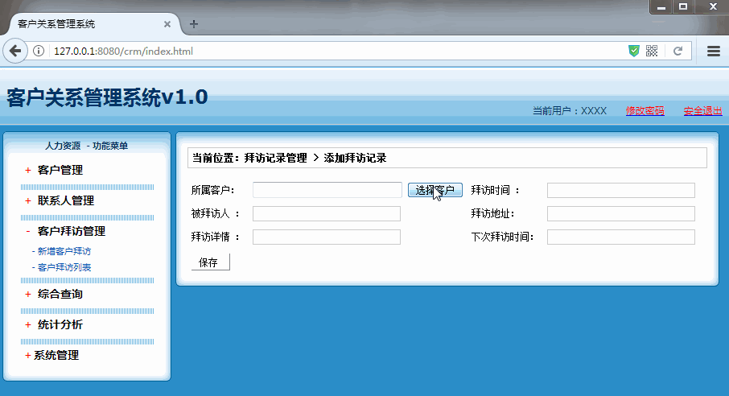
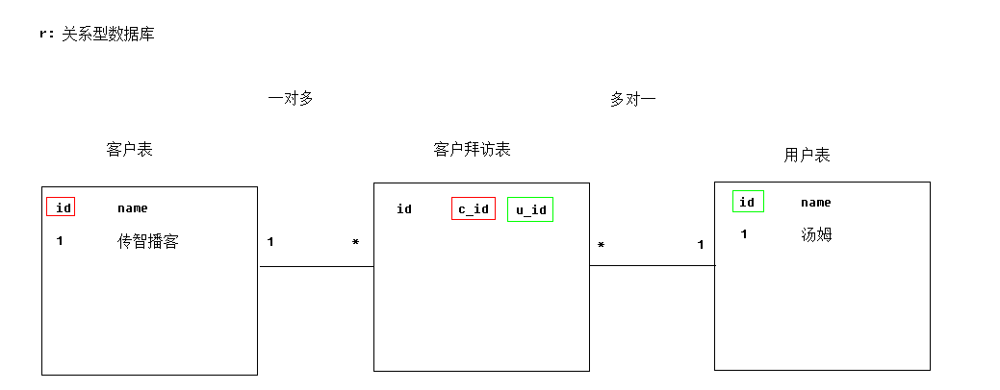
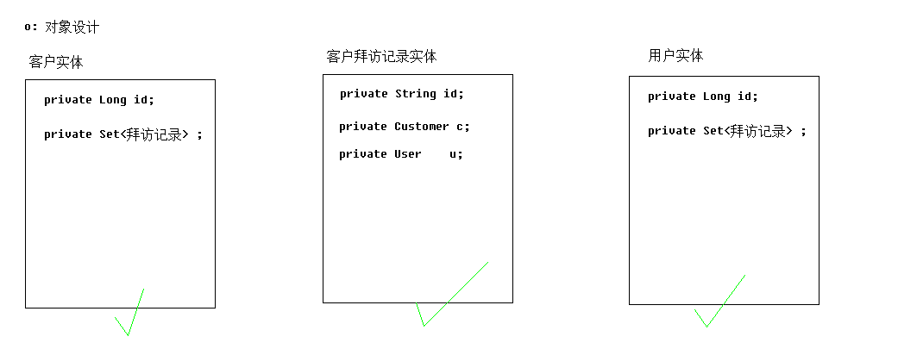
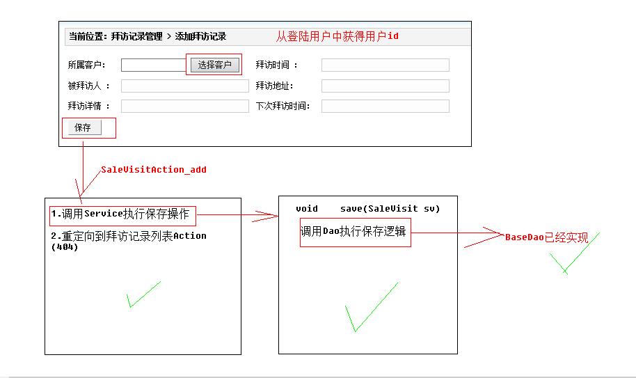

[TOC]

# SSH与SSM学习之SSH实现CRM练习17——添加客户拜访记录和列表

## 一、添加客户拜访记录和列表演示

### 1.1 添加客户拜访记录演示



### 1.2 客户拜访记录列表演示


---

## 二、添加客户拜访记录分析

添加客户拜访记录和添加联系人是一样的。没什么好说的。
列表也如此

---

## 三、添加客户拜访记录表实体关系

### 3.1 表关系




### 3.2 实体



----

## 四、添加客户拜访记录界面分析



----

## 五、SaleVisitAction

```java
/**
 * @author：qiwenming
 * @date：2017/12/3 0003
 * @description：
 * 客户拜访
 */
public class SaleVisitAction extends ActionSupport implements ModelDriven<SaleVisit>{
    private SaleVisit saleVisit = new SaleVisit();
    private SaleVisitService svs ;

    /**
     * 添加客户拜访记录
     * @return
     * @throws Exception
     */
    public String add() throws Exception{
        //1.取出登录用户，放入SaleVisit实体表达关系
        User u = (User) ActionContext.getContext().getSession().get("user");
        saleVisit.setUser(u);
        //2.调用Service保存客户拜访记录
        //加上这个if的原因是这样的，因为我们的SaleVisit的id默认是 "" 在添加记录的时候，回去执行
        //update语句，把id设置为null,那么它就回去执行 save了
        if(saleVisit.getVisit_id()==null || saleVisit.getVisit_id().trim().equals("")) {
            saleVisit.setVisit_id(null);
        }
        svs.save(saleVisit);
        //3.重定向到拜访记录列表Action
        return "toList";
    }

    private Integer currentPage;
    private Integer pageSize;
    public String list() throws Exception {
        //封装离线查询对象
        DetachedCriteria dc = DetachedCriteria.forClass(SaleVisit.class);
        //判断并封装参数
        if(saleVisit.getCustomer()!=null &&saleVisit.getCustomer().getCust_id()!=null){
            dc.add(Restrictions.eq("customer.cust_id",saleVisit.getCustomer().getCust_id()));
        }
        if(saleVisit.getUser()!=null &&saleVisit.getUser().getUser_id()!=null){
            dc.add(Restrictions.eq("user.user_id",saleVisit.getUser().getUser_id()));
        }

        //1 调用Service查询分页数据(PageBean)
        PageBean pb = svs.getPageBean(dc,currentPage,pageSize);
        //2 将PageBean放入request域,转发到列表页面显示
        ActionContext.getContext().put("pageBean", pb);
        return "list";
    }

    /**
     * 编辑
     */
    public String toEdit() throws Exception {
        //1 调用Service根据id查询客户拜访对象
        SaleVisit sv = svs.getById(saleVisit.getVisit_id());
        //2 将对象放入request域
        ActionContext.getContext().put("saleVisit", sv);
        //3 转发到add.jsp
        return "add";
    }

    /**
     * 编辑
     */
    public String delete() throws Exception {
        svs.delete(saleVisit);
        return "toList";
    }

    @Override
    public SaleVisit getModel() {
        return saleVisit;
    }

    public SaleVisitService getSvs() {
        return svs;
    }

    public void setSvs(SaleVisitService svs) {
        this.svs = svs;
    }

    public Integer getCurrentPage() {
        return currentPage;
    }

    public void setCurrentPage(Integer currentPage) {
        this.currentPage = currentPage;
    }

    public Integer getPageSize() {
        return pageSize;
    }

    public void setPageSize(Integer pageSize) {
        this.pageSize = pageSize;
    }
}

```

----

## 六、SaleVisitServiceImpl

```java
/**
 * @author：qiwenming
 * @date：2017/12/3 0003
 * @description：
 * 客户拜访
 */
public class SaleVisitServiceImpl implements SaleVisitService {
    private SaleVisitDao svd;
    @Override
    public void save(SaleVisit saleVisit) {
        svd.saveOrUpdate(saleVisit);
    }

    @Override
    public PageBean getPageBean(DetachedCriteria dc, Integer currentPage, Integer pageSize) {
        //1 调用Dao查询总记录数
        Integer totalCount = svd.getTotalCount(dc);
        //2 创建PageBean对象
        PageBean pb = new PageBean(currentPage, totalCount, pageSize);
        //3 调用Dao查询分页列表数据

        List<SaleVisit> list = svd.getPageList(dc,pb.getStart(),pb.getPageSize());
        //4 列表数据放入pageBean中.并返回
        pb.setList(list);
        return pb;
    }

    @Override
    public SaleVisit getById(String visit_id) {
        return svd.getById(visit_id);
    }

    @Override
    public void delete(SaleVisit saleVisit) {
        svd.delete(saleVisit);
    }

    public void setSvd(SaleVisitDao svd) {
        this.svd = svd;
    }
}
```
----

## 七、源码位置

### 7.1 add.jsp

[https://github.com/wimingxxx/ssh_crm/blob/master/web/jsp/salevisit/add.jsp](https://github.com/wimingxxx/ssh_crm/blob/master/web/jsp/salevisit/add.jsp)


### 7.2 list.jsp

[https://github.com/wimingxxx/ssh_crm/blob/master/web/jsp/salevisit/list.jsp](https://github.com/wimingxxx/ssh_crm/blob/master/web/jsp/salevisit/list.jsp)


### 7.3 SaleVisitAction.java

[https://github.com/wimingxxx/ssh_crm/blob/master/src/com/qwm/ssh_crm/web/action/SaleVisitAction.java](https://github.com/wimingxxx/ssh_crm/blob/master/src/com/qwm/ssh_crm/web/action/SaleVisitAction.java)


### 7.4 SaleVisitService.java

[https://github.com/wimingxxx/ssh_crm/blob/master/src/com/qwm/ssh_crm/service/SaleVisitService.java](https://github.com/wimingxxx/ssh_crm/blob/master/src/com/qwm/ssh_crm/service/SaleVisitService.java)

### 7.5 SaleVisitServiceImpl.java

[https://github.com/wimingxxx/ssh_crm/blob/master/src/com/qwm/ssh_crm/service/impl/SaleVisitServiceImpl.java](https://github.com/wimingxxx/ssh_crm/blob/master/src/com/qwm/ssh_crm/service/impl/SaleVisitServiceImpl.java)

### 7.6 applicationContext.xml

[https://github.com/wimingxxx/ssh_crm/blob/master/src/applicationContext.xml](https://github.com/wimingxxx/ssh_crm/blob/master/src/applicationContext.xml)

### 7.7 struts.xml

[https://github.com/wimingxxx/ssh_crm/blob/master/src/struts.xml](https://github.com/wimingxxx/ssh_crm/blob/master/src/struts.xml)


----

## 八、源码下载

[https://github.com/wimingxxx/ssh_crm](https://github.com/wimingxxx/ssh_crm)
